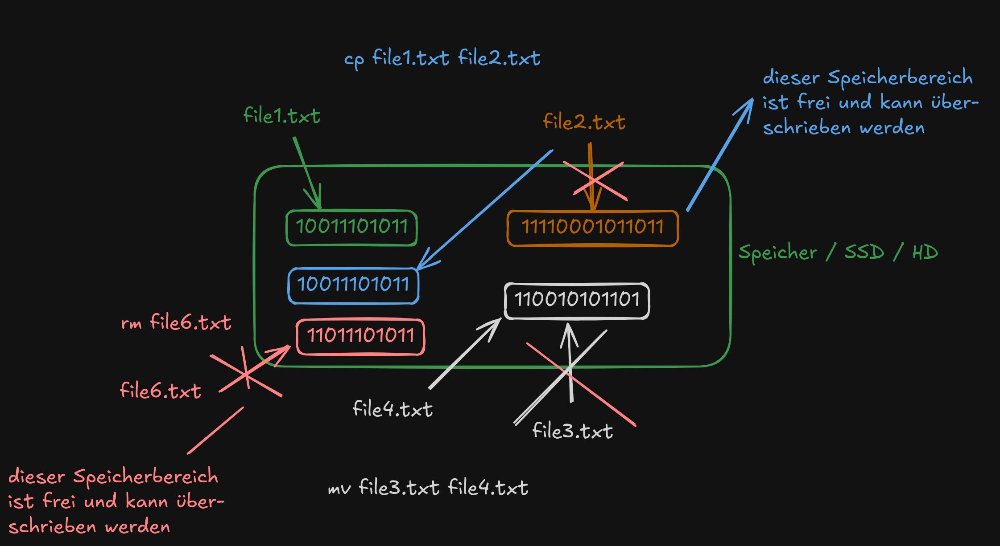

# Dokumentation Linux Essentials

## Unterschied Terminal / Shell

Ein Terminal ist heutzutage ein Programm (früher ein physisches Gerät), das die Ein- und Ausgabe für eine Shell bereitstellt. Das Terminal zeigt an, was die Shell ausgibt und nimmt Tastatureingaben entgegen. Es ist eine Art _Benutzeroberfläche_ durch die wir mit einer Shell interagieren können.

Eine Shell ist ein _Kommando-Interpreter_. Sie nimmt Kommandos entgegen und interpretiert diese.

In Linux dient die Shell unter anderem dazu, als Vermittler zwischen Benutzer und Betriebssytem zu fungieren. Shells werden generell genutzt, um einzelne Befehle (z.B. einer Skriptsprache) zu interpretieren und auszuführen. 

Die Python Shell kann z.B. Python Kommandos ausführen, in einer MySQL Shell können Datenbanken erstellt und verwaltet werden usw.

Unter Linux nutzen wir in der Regel die _BASH_ (_Bourne Again Shell_) als Shell. Auch hier gibt es einige `sh` kompatible Varianten wie die _ZSH_, _KSH_, _Fish-Shell_ etc.

## Kommandos

### Aufbau von Kommandos:

```
<kommando> [-<kurzoption>]... [<argument>]...
<kommando> [--<langoption>]... [<argument>]...
```

Erklärung zur obigen Syntax (angelehnt an Manpages):

- `[  ]` was in eckigen Klammern steht, ist **optional** -> wir können also Optionen oder Argumente übergeben, **müssen** es aber nicht
- `...` die drei Punkte bedeuten, dass auch mehrere Optionen oder Argumente übergeben werden können
- dies ist übrigens die gleiche Syntax, die auch in den Manpages verwendet wird

>[!NOTE]
> Es macht fast immer keinen Unterschied, ob wir die Option(en) vor oder nach den Argumenten schreiben:
> ```bash
> rm -r somedir
> rm somedir -r
>```

#### einige Beispiele 

```
ls -l               # Übergabe der Option -l
ls /etc             # Übergabe des Arguments /etc
ls -la              # Übergabe mehrerer Optionen
ls -al              # Übergabe mehrerer Optionen, Reihenfolge fast immer egal
ls -la /etc /home   # Übergabe mehrerer Optionen und Argumente
```

### Grundlegende Kommandos

- `whoami` gibt den aktuellen Benutzer aus
- `pwd` gibt das aktuelle Verzeichnis aus
- `ls` zeigt den Inhalt von Verzeichnissen an
- einige Optionen von `ls`:
  - `ls -a` ignoriert keine Einträge, die mit einem Punkt beginnen -> zeigt auch "versteckte" Dateien an
  - `ls -l` zeigt ausführliche Details zu den Dateien an
- `touch` erstellt eine leere Datei
- `mkdir` erstellt ein Verzeichnis 
- `cat` gibt den Inhalt einer Datei auf der Kommandozeile aus

### Manpages

*Manual Pages*: eine Art Handbuch zu einzelnen Kommandos, mit Erklärungen zur Syntax, allen Optionen, teilweise Beispielen etc.

- `man <kommando>` 
- z.B. `man ls` Handbuchseite zum Kommando `ls`
- Suche in den Manpages: Eingabe von `/` gefolgt vom Suchbegriff, z.B. `/-l` sucht nach der Option `-l`
- zum nächsten Suchbegriff mit `n`
- zum vorherigen Suchbegriff mit `N`
- zum Anfang der Manpage springen mit `g`
- ans Ende mit `G`
- Manpage schliessen mit `q`

### Help

*Kurzhilfe* zu einem Kommando durch Übergabe der Option `--help` -> `ls --help`

### Shell-Builtins
In die Shell (in unserem Fall BASH) eingebaute Kommandos. Sie sind essenziell bzw. wichtig, damit die Shell an sich funktioniert, z.B. das Kommando `cd`. 

Builtins haben keine eigene Manpage, ihre Funktionsweise ist in der Manpage der BASH erklärt. Eine Kurzhilfe zu den Builtins erhält man mit dem Kommando `help`.

### Extern realisierte Kommandos
Die meisten Kommandos sind _extern realisiert_, d.h. sie sind nicht in die BASH eingebaut. So gut wie alle _extern realisierten_ Kommandos haben eine Manpage (`man <kommando>`) in welcher die Art wie das Kommando zu benutzen ist und sämtliche Optionen mit Erklärungen angegeben sind.

## History

Eine Liste aller bisher eingegebenen Kommandos.

- Blättern durch die History mit den Pfeiltasten oder `STRG+P` bzw. `STRG+N`
- Die History wird zuerst pro Shell im RAM gespeichert, beim Beenden der Shell wird die History in eine Datei geschrieben (z.B. `.bash_history` oder auch `.zsh_history`)
- Die Gröẞe der Datei bzw. die Menge der Einträge kann konfiguriert werden
- Jeder Benutzer hat somit seine eigene History (so z.B. auch der User `root`)
- Mit dem Kommando `history` wird eine Liste aller Befehle inklusive eines Index angezeigt
- Wir können so das Konzept der *History Expansion* nutzen:
  - `!<index>` ruft das Kommando mit `<index>` auf
  - `!-<zahl>` ruft das Kommando mit `<zahl>` von hinten auf
  - `!<zeichenfolge>` ruft das letzte Kommando auf, das mit `<zeichenfolge>` begonnen hat
  - `!?<zeichenfolge>` ruft das letzte Kommando auf, das `<zeichenfolge>` enthält
- Die Tastenkombination `<STRG r>` ruft die *reverse-i-search* auf, so dass wir eine Zeichenfolge eingeben können und das Kommando, welches Zeichenfolge enthält angezeigt wird. Durch erneutes Drücken von `<STRG r>` rufen wir das vorletzte Kommando mit dieser Zeichenfolge auf usw.

## Dateioperationen

### Dateien erstellen mit `touch`

Dateien können auf vielfältige Art und Weise erstellt werden. Ein einfacher Weg, leere Dateien zu erstellen, ist mit dem Kommando `touch`.
```bash
touch <name-der-datei>
touch <name-der-datei-1> <name-der-datei-2> ...
touch <pfad-zur-datei>
```

### Verzeichnisse erstellen mit `mkdir`

Mit dem Kommando `mkdir` (*make directory*) können wir Verzeichnisse erstellen.
```bash
mkdir <name-des-verzeichnisses>
mkdir <pfad-zum-verzeichniss>

TODO
```

### Dateien/Verzeichnisse kopieren mit `cp`

Dateien und Verzeichnisse können mit dem Kommando `cp` (*copy*) kopiert werden.

```bash
cp <quelle> <ziel>
cp <pfad-zur-quelle> <pfad-zum-ziel>
```

**Vorsicht:** Wenn wir eine bestehende Datei als Ziel angeben, wird die Zieldatei **ohne Nachfrage** ersetzt/überschrieben und nicht etwas der Inhalt der Quelldatei an die Zieldatei angefügt oder eine Warnung angezeigt.

Beim Kopieren von Verzeichnissen müssen wir an die Option `-r` (*rekursiv*) denken. 

```bash
cp -r <quellverzeichnis> <zielverzeichnis>
```

Der Grund ist, dass ein Verzeichnis nicht leer ist, die Kopieraktion also wiederholt/_rekursiv_ ausgeführt werden muss.

> [!NOTE] 
> Dies gilt übrigens für sehr viele Kommandos: funktioniert die Anwendung eines Kommandos auf eine Datei, nicht aber auf ein Verzeichnis, so fehlt oft einfach nur die Option `-r`.

### Dateien/Verzeichnisse löschen mit `rm`

Dateien und Verzeichnisse können mit dem Kommando `rm` (*remove*) gelöscht werden.

Analog zum Kopieren von Verzeichnissen müssen wir auch beim Löschen von Verzeichnissen die Option `-r` angeben.


```bash
rm <pfad-zur-datei>
rm -r <pfad-zum-verzeichniss>
```

>[!NOTE]
> Wenn wir eine Datei löschen, so löschen wir nicht die Datei an sich. Wir entfernen lediglich den Dateinamen bzw. Pointer auf die Daten der Datei auf dem Speichermedium. Dieser Bereich im Speicher wird dann als wieder überschreibbar gemeldet.
>
> Die Daten könnten also solange keine weitere Schreiboperation auf diesen Speicherbereich erfolgt ist wiederhergestellt werden.

### Leere Verzeichnisse löschen mit `rmdir`

**Leere** Verzeichnisse können zusätzlich mit dem Kommando `rmdir` gelöscht werden.

Nützlich, um z.B. nach einem Aufräumen sicher zu sein, nur leere Verzeichnisse zu löschen, z.B. mit `rmdir *`. So werden alle leeren Verzeichnisse gelöscht, Verzeichnisse mit Inhalt aber nicht und wir bekommen zusätzlich eine Liste aller Verzeichnisse mit Inhalt.

### Dateien/Verzeichnisse verschieben/umbenennen mit `mv`

Dateien und Verzeichnisse können mit dem Kommando `mv` (*move*) verschoben und umbenannt werden.

Beim Verschieben von Verzeichnissen dürfen wir die Option `-r` *nicht* angeben. Der Grund dafür ist, dass beim Verschieben nicht wie vielleicht angenommen eine Art *ausschneiden* und *einfügen* stattfindet, sondern wie beim Löschen lediglich der Dateiname/Pfad ersetzt wird. 

Es muss also keine rekursive Operation auf dem Speichermedium stattfinden. Das ist auf unten stehendender Illustration vielleicht besser zu erkennen.

Ausnahme: Wird einen Datei auf eine andere Partition/Datenträger verschoben, so findet tatsächlich ein kopieren und anschlieẞdendes Löschen statt.

```bash
mv <quelle> <ziel>
mv <quellverzeichnis> <zielverzeichnis>
mv <alter-name> <neuer-name>
```

### Illustration kopieren, löschen, verschieben



## relative und absolute Pfadangaben


Immer wenn wir eine Dateioperation durchführen, müssen wir den Pfad (eine Art *Wegbeschreibung*) zu der jeweiligen Datei angeben. Diese Angabe können wir auf zwei unterschiedliche Arten und Weisen machen: *relativ* oder *absolut*.

### absolute Pfadangaben

Eine *absolute Pfadangabe* beschreibt den Weg ausgehend von der Wurzel `/` (z.B. `C:` in Windows) des Dateisystembaums.

```bash
cp /home/tux/somefile /home/tux/Somedir
```

Absolute Pfadangaben können wir immer daran erkennen, dass das erste Zeichen des Pfades ein Slash `/` ist.

Einzige Ausnahme ist die Tilde `~`, welche den absoluten Pfad zum Heimatverzeichnis des aufrufenden Benutzers symbolisiert. Folgende Pfadangaben sind identisch:

```bash
cd ~/Somedir
cd /home/tux/Somedir
```

### relative Pfadangaben

Eine *relative Pfadangabe* beschreibt den Weg ausgehend vom **aktuellen Standort** (alsoe dem aktuellen Verzeichnis) im Dateisystem.

```bash
cp somefile Somedir/
```

### spezielle Verzeichniseinträge (Special Directory Entries) . und ..

- Sie gehören zur Kategorie der relativen Pfadangaben (Relative Pathnames)
- Sie werden auch als *Pseudodirektoren* (Pseudo-Directories) bezeichnet
- Manchmal nennt man sie auch *Implizite Links* oder *Selbstreferenzierende Einträge*
- Formal sind sie aber einfach reguläre Einträge im Dateisystem, die bei jedem Verzeichnis automatisch vorhanden sind.
- `.` (Punkt) symbolisiert das aktuelle Verzeichnis
- `..` (doppelter Punkt) symbolisiert das übergeordnete Verzeichnis (Parent Directory)

## Editor nano

`nano` ist ein einfacher Editor, der auf den meisten Linux Distributionen vorinstalliert ist. Als Hilfe zur Bedienung wird unten ein Menü mit Tastenkürzeln angezeigt. Hier bedeutet das Zeichen `^` die Taste `STRG`.

Einige wichtige Tastenkombinationen:

- `STRG+O` Datei speichern unter...  (Name kann/muss angegeben werden)
- `STRG+S` Datei speichern (unter dem gleichen Namen)
- `STRG+X` Editor verlassen (bei ungespeicherten Änderungen werden wir gefragt, ob wir diese speichern möchten)

Von der Einfachheit der Bedienung einmal abgesehen - der beste Editor der Welt ist neovim. Keine Frage. :)

## Aliase

Aliase sind selbstdefinierte Abkürzungen für Kommandos mit Optionen. Wir verwenden Aliase z.B. für häufig verwendete Kommandos mit Optionen oder auch Argumenten wie Pfadangaben.

Das Kommando `alias` an sich zeigt alle in der aktullen Shell gültigen Aliase an.

### Definition von Aliasen
```bash
alias <name-des-aliases>='<kommando> -<option> <argument>'
alias la='ls -a'
alias rm='rm -i'
alias somedir='cd ~/path/to/specific/dir/'
```

Wenn wir Aliase einfach so auf der Kommandozeile definieren, sind diese nur in der aktullen Shell gültig. Wollen wir Aliase persistent definieren (für alle neu geöffneten Shells bzw. auch nach einem Reboot), so müssen wir die Definition in dafür vorgesehene Dateien eintragen.

Dieses Konzept gilt nicht nur für Aliase, sondern generell für die Konfiguration unseres Systems.

Aliase werden z.B. direkt in der Datei `~/.bashrc` oder besser noch in der Datei `~/.bash_aliases` definiert (wenn wir als Shell die BASH verwenden).

Das Eintragen der Aliase in eine dieser Dateien macht sie aber noch nicht sofort gültig. Wir müssen dafür sorgen, dass die entsprechende Datei neu eingelesen wird. Das geht über mehrer Wege:

- Neutstart des Rechners (nicht wirklich sinnvoll)
- Logout und Login (bei SSH)
- Starten einer Subshell mit dem Kommando `bash`
- Übergeben der Datei an das Kommando `source` -> `source ~/.bashrc`
- Ausführen von `exec bash` (-> hier wird keine Subshell gestartet, sondern die aktuelle Shell durch einen neue ersetzt)

### Löschen von Aliasen

```
unalias <name-des-aliases>
unalias lsa
```

Definierte Aliase können mit dem Kommando `unalias` wieder gelöscht werden.

Die Opione `-a` löscht alle Aliase (`unalias -a`).

Möchte man ein Kommando für das ein Alias definiert ist ohne die Aliasdefinition aufrufen, so gibt man einfach den absoluten Pfad zu diesem Kommando an.

```bash
# ls als Alias mit --color=auto ausführen:
ls 

# ls ohne --color=auto ausführen:
/usr/bin/ls
```

## Pattern Matching / Globbing / Wildcards

Ein *Pattern* ist ein *Muster*, bzw. ein *Platzhalter* oder *Wildcard* welches auf eine Zeichenfolge passt, so dass wir damit z.B. nach Dateien bzw. Pfadangaben suchen können (mit entsprechenden Kommandos) bzw. mehrere Dateien auf einmal ansprechen können.

Wir können in einem *Pattern* bestimmte Sonderzeichen verwenden, um dieses allgemeingültiger zu machen:

*Globbing Characters:*

- `*` (*Asterisk*) -> Steht für beliebige Zeichen, welche beliebig oft vorkommen können (auch keinmal)
- `?` -> Steht für jedes beliebige Zeichen, welches **exakt** einmal vorkommt

Weitere Möglichkeiten für Pattern Matching:

- `!(pattern)` Exkludiert das angegebene Pattern (in dem Pattern dürfen auch wieder die oben angegebenen *Globbing Characters* vorkommen
- `[!pattern]` Exkludiert das angegebene Pattern (in dem Pattern dürfen auch wieder die oben angegebenen *Globbing Characters* vorkommen

Beispiele:
```bash
rm *.jpg       # löscht alle Dateien mit der Endung .jpg
ls datei?.txt  # zeigt nur Dateien an, bei denen nach der Zeichenfolge datei noch ein weiteres beliebiges Zeichen folgt und die die Endung .txt haben
mv !(o*) ../somdir/    # verschiebt alle Dateien des aktuellen Verzeichnisses nach ../somedir, ausser Dateien, die mit einem o beginnen
mv [!o]* ../somdir/    # verschiebt alle Dateien des aktuellen Verzeichnisses nach ../somedir, ausser Dateien, die mit einem o beginnen
```

## Escaping / Quoting

Bestimmte Zeichen haben eine Sonderbedeutung für die BASH. Das wohl wichtigste Sonderzeichen ist das *Leerzeichen*: 

> Das Leerzeichen ist ein Sonderzeichen. Das Leerzeichen ist das **Trennzeichen**. Das Trennzeichen ist elementar wichtig für die Shell, um z.B. ein Kommando von seinen Optionen und Argumenten unterscheiden zu können.

Weitere Sonderzeichen sind:
```bash
*       # Asterisk (Globbing)
?       # Fragezeichen (Globbing)
#       # Kommentarzeichen
$       # Subsitution
!       # History Expansion
\       # Backslash (Escaping)
'       # Escaping
"       # Escaping
;       # beendet eine Eingabe
```

TODO

## Variablen

### Umgebungsvariablen / Environment Variables

Sind systemweit gültig, enthalten wichtige Informationen, damit unser System wie gewünscht funktioniert, bestimmte Kommandos greifen auf diese Variablen zurück. Umgebungsvariablen werden nach Konvention komplett in Grossbuchstaben geschrieben.

Einige Beispiele:
```bash
$HOME       # Heimatverzeichnis des aktuellen Benutzers
$PWD        # absoluter Pfad des aktuellen Verzeichnisses
$USER       # Login Name des aktuellen Benutzers
$SHELL      # Shell des aktuellen Benutzers
$PATH       # Liste der Verzeichnisse, die nach ausführbaren Dateien durchsucht werden, so dass wir diese ohne eine Pfadangabe aufrufen können
```

Systemvariablen können unterschiedliche Werte enthalten, je nachdem welcher Benutzer angemeldet ist. 

#### PATH-Variable

Eine besonders wichtige Umgebungsvariable ists die PATH-Variable. Sie enthält eine durch Doppelpunkte `:` getrennte Liste von Verzeichnissen, die **der Reihenfolge nach** von der Shell durchsucht werden, wenn ein Kommando eingegeben wird. Sobald das entsprechende Kommando gefunden wird, beendet die Shell die Suche und führt dieses Kommando aus. 

So ist es möglich, ein Kommando auszuführen, ohne den Pfad (absolut oder relativ) dorthin angeben zu müssen.

##### PATH erweitern
Unter gewissen Umständen möchten wir die PATH-Variable um ein weiteres Verzeichnis erweitern. Zum Beispiel haben wir ein Skript erstellt und wollen es ohne Pfadangabe ausführen können. Dann können wir das Verzeichnis in dem das Skript liegt, dieser Variable hinzufügen. Hier ist die Reihenfolge wichtig, vor allem falls das Skript genauso heisst wie ein bereits existierendes Programm. 

Wir denken hier an unser Beispiel mit dem Skritp `rm` für den Papierkorb. Dieses Skript haben wir im Verzeichnis `~/bin` abgelegt und wollen, dass es anstatt des eingebauten Kommandos `/usr/bin/rm` ausgeführt wird. Wir erweitern `PATH` also wie folgt:
```bash
echo $PATH=/usr/local/bin:/usr/bin:/bin:/usr/local/games:/usr/games

export PATH="/home/tux/bin:$PATH"

echo $PATH=/home/tux/bin:/usr/local/bin:/usr/bin:/bin:/usr/local/games:/usr/games/
```

### Shellvariablen / Shell Variables

Sind nur gültig in der aktuellen Shell, können vom Benutzer selbst definiert werden. Werden **nicht** automatisch in Subshells vererbt, es sei denn sie werden mit dem Kommando `export` exportiert.
```bash
foo=bar         # weist der Variablen foo den Wert bar zu
export foo      # macht die Variable foo auch in Subshells gültig
export hallo=huhu # weist der Variablen hallo den Wert huhu zu und macht diese in Subshells gültig
```

### Variablensubstitution

Bei der Variablensubstitution wird der Name der Variablen mit dem in ihr hinterlegten Wert ersetzt.

```bash
echo $foo       # gibt den Wert der Variablen foo aus
echo ${foo}     # gibt den Wert der Variablen foo aus
```

### Kommandosubstitution

Durch die *Kommandosubstitution* können wir Variablen die Ausgabe eines Kommandos zuweisen. Genauer gesagt wird eine *Subshell* gestartet, in welcher das Kommando ausgeführt wird.
```bash
aktuelles_datum=$(date)
aktuelles_datum=`date`     # veraltete Syntax
```

### Rechnen mir Variablen / Arithmetic Operations

Wir können auch einfache Rechenoperationen in der BASH durchführen:
```bash
zahl1=3
zahl2=4
summe=$(( zahl1 + zahl2 ))
summe=$((zahl1+zahl2))
let summe = $zahl1 + $zahl2 
```

#### Subshells

Innerhalb einer laufenden Shell können weitere Shells gestartet werden. Dies sind sogenannte *Subshells* oder *Kindshells*. Diese können entweder aktiv, z.B. durch die Eingabe des Kommandos `bash` gestartet werden. 

Subshells sind separate Instanzen der Shell, die von der Hauptshell gestartet werden. Sie sind ein fundamentales Konzept in Linux/Unix-Systemen.

Subshells werden aber auch oft gestartet, ohne dass wir dies merken.

Z.B. werden Kommandos, Funktionen, Skripte in Subshells ausgeführt, auch wenn wir davon direkt gar nichts mitbekommen. Auch Pipes und runde Klammern `()` erzeugen Subshells. 

Es ist wichtig zu wissen, dass z.B. Aliase und Variablen **nicht** automatisch in Subshells vererbt werden!

Auch beim Wechsel in einen anderen Benutzeraccount wird eine Subshell mit den Berechtigungen dieses Benutzers gestartet.

Wir können uns einen Überblick über die momentan laufenden Shells bzw. Subshells mit dem Kommando `ps` verschaffen, oder in der BASH über die Variable `BASH_SUBSHELL`
```
echo $BASH_SUBSHELL   # zeigt 0 in Hauptshell, >0 in Subshells
(echo $BASH_SUBSHELL) # zeigt 1
```
##### Eigenschaften von Subshells
**Vererbung**:

- **Umgebungs**variablen werden vererbt (als **Kopie**)
- Funktionen werden vererbt
- Arbeitsverzeichnis wird vererbt

**Isolation**:

- Änderungen in der Subshell beeinflussen die Parent-Shell **nicht**
- (neue) Shellvariablen werden nicht vererbt/sind nicht sichtbar
- `cd` in einer Subshell ändert nicht das Verzeichnis der Parent-Shell

##### Praktische Beispiele
###### Variablen-Isolation
```
var="parent"
(var="child"; echo "In Subshell: $var")
echo "In Parent-Shell: $var"
# Ausgabe: "child" dann "parent"
```
###### ArbeitsverzeichnisIsolation
```
pwd                   # z.B. /home/tux
(cd /tmp; pwd)        # zeigt /tmp
pwd                   # zeigt wieder /home/tux
```
###### Typisches Problem mit Pipes
```
count=0
echo -e "1\n2\n3" | while read line; do
    ((count++))       # läuft in Subshell!
done
echo "Count: $count"  # zeigt 0, nicht 3!

# Lösung:
count=0
while read line; do
    ((count++))
done < <(echo -e "1\n2\n3")
echo "Count: $count"  # zeigt 3
```

## Textströme und Standardkanäle

| Kanalbezeichnung | Filedescriptor | Nummer |
| ---------------- | -------------- | ------ |
| *Standareingabekanal*  | `stdin` | 0 |
| *Standardausgabekanal*|  `stdout` | 1 |
| *Standardfehlerkanal*  | `stderr` | 2 |


Jeder Prozess der gestartet wird, wird mit diesen drei Standardkanälen verbunden. Über diese Kanäle erhält der Prozess Daten und gibt sie auch wieder aus. So können Ein- und Ausgaben unabhängig voneinander verarbeitet und auch umgeleitet werden.

Die Kanäle jedes Prozesses, der in einer Shell gestartet wird, sind automatisch mit der Shell verbunden.

Durch dieses Konzept können wir durch die Kombination simpler Kommandos komplexe Aufaben lösen (-> *Kommandopipelines*) 

Wir können so z.B. auch Ausgaben von Kommandos in Dateien umleiten (-> *Redirects*).

## UNIX Philosophie

Die Unix-Philosophie ist ein Satz von Prinzipien für Software-Design, die ursprünglich in den 1970er Jahren mit dem Unix-Betriebssystem entwickelt wurden. Sie betont Einfachheit, Modularität und Wiederverwendbarkeit.

Douglas McIlroy, der Erfinder der Unixpipes, fasste die Philosophie folgendermaßen zusammen:

- Schreibe Computerprogramme so, dass sie nur eine Aufgabe erledigen und diese gut machen.
- Schreibe Programme so, dass sie zusammenarbeiten.
- Schreibe Programme so, dass sie Textströme verarbeiten, denn das ist eine universelle Schnittstelle.

> "Write programs that do one thing and do it well."

## KISS Prinzip

- "Keep it stupid simple"
- "Keep it super simple"
- "Keep it simple, stupid!"

## Redirects

Mit Redirects kann die der Standardausgabekanal oder der Standardfehlerkanal in eine **Datei** umgeleitet werden. Es gibt zwei Arten von Redirects:

- `>` - einfacher Redirect: Erstellt eine Datei falls nicht vorhanden, **leert** eine bereits vorhandene Datei
- `>>` - doppelter Redirect: Erstellt eine Datei falls nicht vorhanden, **hängt Ausgabe an**

#### Umleitung des Standardausgabekanals
```bash
echo huhu 1> hallo.txt   # die 1 gibt hier die Kanalnummer an
echo huhu 1>> hallo.txt  # die 1 gibt hier die Kanalnummer an
echo huhu > hallo.txt    # kann bei stdout auch weggelassen werden
```
```bash
ls -l /etc > ls-ausgabe.txt
ls -l /etc >> ls-ausgabe.txt
```

#### Umleitung des Standardfehlerkanals
```bash
ls mich-gibts-nicht  2> ls-fehler.txt     # hier muss die 2 stehen, da wir stderr umleiten
ls mich-gibts-nicht  2>> ls-fehler.txt    # hier muss die 2 stehen, da wir stderr umleiten
```

#### Umleitung beider Kanäle

##### in separate Dateien
```bash
ls mich-gibts/ mich-gibts-nicht/ 1> ergebnis.txt 2>fehler.txt
ls mich-gibts/ mich-gibts-nicht/ > ergebnis.txt 2>fehler.txt
```

##### in die gleiche Datei
```bash
ls mich-gibts/ mich-gibts-nicht/ > ergebnis-und-fehler.txt 2>&1
```

>[!NOTE]
> Das `&` gibt hier an, dass wir einen *Kanal*/*Filedescriptor* meinen, ansonsten würden die Fehler in eine Datei mit dem Namen `1` umgeleitet werden.
> Das `2>&1` muss in diesem Fall hinter dem `>` stehen, da die Redirects an sich von links nach rechts ausgewertet werden. `stdout` muss also bereits in die Datei umgeleitet sein, damit auch `stderr` dorthin schreibt. Ansonsten würde der Fehlerkanal mit dem *eigentlichen* Ziel, nämlich der Shell verknüpft werden.

```bash
ls mich-gibts/ mich-gibts-nicht/ &> ergebnis-und-fehler.txt
```
>[!NOTE]
> Verkürzte Schreibweise


###### Eigenbaulösung
Theoretisch könnte man sich obiges Verhalten auch selber bauen, z.B. so:
```bash
ls mich-gibts/ mich-gibts-nicht/ > ergebnis-und-fehler.txt 2>> ergebnis-und-fehler.txt
```

Das **kann** gut gehen, aber auch zu einem nicht gewollten Verhalten führen, da beide Filedescriptoren versuchen, **zur gleichen Zeit** in die gleiche Datei zu schreiben, was zu einer *Race Condition* führen kann:

|Zeitpunkt | stdout schreibt | stderr schreibt | Dateiinhalt |
| -------- | --------------- | --------------- | ----------- |
|t0         | (Position 0)    | (Position 0)   | ""          |
|t1         | "mich-gibts:\n"    | -               | "mich-gibts:\n" |
|           |(Position → 12)  |     (Position 0)|        |
|t2         |"test\n"         | -              | "mydir:\ntest\n"|
|           |(Position → 17)  |     (Position 0)|  |
|t3         | -               | "ls: cannot access..."|"ls: cannot a..."|
|           |                 | (Position → 65) | |

Das Problem: Beide Zeiger starten bei Position 0.

Wenn `stderr` später schreibt, überschreibt es teilweise das, was `stdout` geschrieben hat. Die genaue Ausgabe hängt davon ab:

- Wie schnell die Prozesse schreiben
- Wann das Betriebssystem die Schreiboperationen ausführt
- Puffergröße und Timing

Daher erscheint entweder gar keine Fehlermeldung, oder sie ist abgeschnitten etc.

##### Warum funktioniert `2>&1`?
- `>`  öffnet Filedescriptor 1 für die Datei
- `2>&1` macht Filedescriptor 2 zu einer Kopie von Filedescriptor 1
- Beide teilen sich denselben Schreibzeiger
- Die Shell koordiniert die Schreibvorgänge, so dass es zu keinen Überschreibungen kommt


