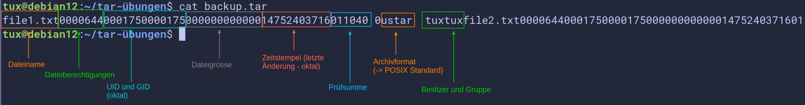
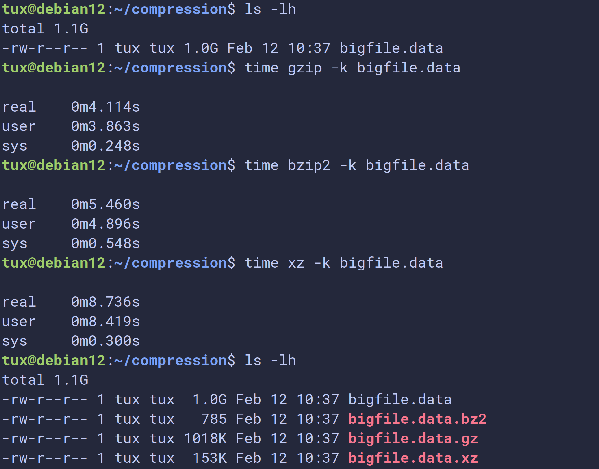
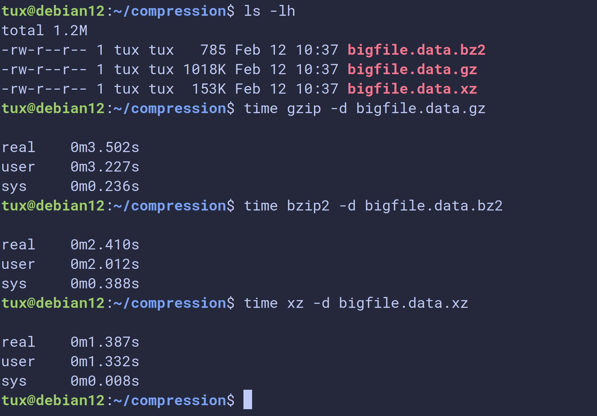

# Dokumentation Linux Essentials

## Unterschied Terminal / Shell

Ein Terminal ist heutzutage ein Programm (früher ein physisches Gerät), das die Ein- und Ausgabe für eine Shell bereitstellt. Das Terminal zeigt an, was die Shell ausgibt und nimmt Tastatureingaben entgegen. Es ist eine Art _Benutzeroberfläche_ durch die wir mit einer Shell interagieren können.

Eine Shell ist ein _Kommando-Interpreter_. Sie nimmt Kommandos entgegen und interpretiert diese.

In Linux dient die Shell unter anderem dazu, als Vermittler zwischen Benutzer und Betriebssytem zu fungieren. Shells werden generell genutzt, um einzelne Befehle (z.B. einer Skriptsprache) zu interpretieren und auszuführen. 

Die Python Shell kann z.B. Python Kommandos ausführen, in einer MySQL Shell können Datenbanken erstellt und verwaltet werden usw.

Unter Linux nutzen wir in der Regel die _BASH_ (_Bourne Again Shell_) als Shell. Auch hier gibt es einige `sh` kompatible Varianten wie die _ZSH_, _KSH_, _Fish-Shell_ etc.

## Kommandos

### Aufbau von Kommandos:

```
<kommando> [-<kurzoption>]... [<argument>]...
<kommando> [--<langoption>]... [<argument>]...
```

Erklärung zur obigen Syntax (angelehnt an Manpages):

- `[  ]` was in eckigen Klammern steht, ist **optional** -> wir können also Optionen oder Argumente übergeben, **müssen** es aber nicht
- `...` die drei Punkte bedeuten, dass auch mehrere Optionen oder Argumente übergeben werden können
- dies ist übrigens die gleiche Syntax, die auch in den Manpages verwendet wird

>[!NOTE]
> Es macht fast immer keinen Unterschied, ob wir die Option(en) vor oder nach den Argumenten schreiben:
> ```bash
> rm -r somedir
> rm somedir -r
>```

#### einige Beispiele 

```
ls -l               # Übergabe der Option -l
ls /etc             # Übergabe des Arguments /etc
ls -la              # Übergabe mehrerer Optionen
ls -al              # Übergabe mehrerer Optionen, Reihenfolge fast immer egal
ls -la /etc /home   # Übergabe mehrerer Optionen und Argumente
```

### Grundlegende Kommandos

- `whoami` gibt den aktuellen Benutzer aus
- `pwd` gibt das aktuelle Verzeichnis aus
- `ls` zeigt den Inhalt von Verzeichnissen an
- einige Optionen von `ls`:
  - `ls -a` ignoriert keine Einträge, die mit einem Punkt beginnen -> zeigt auch "versteckte" Dateien an
  - `ls -l` zeigt ausführliche Details zu den Dateien an
- `touch` erstellt eine leere Datei
- `mkdir` erstellt ein Verzeichnis 
- `cat` gibt den Inhalt einer Datei auf der Kommandozeile aus

### Manpages

*Manual Pages*: eine Art Handbuch zu einzelnen Kommandos, mit Erklärungen zur Syntax, allen Optionen, teilweise Beispielen etc.

- `man <kommando>` 
- z.B. `man ls` Handbuchseite zum Kommando `ls`
- Suche in den Manpages: Eingabe von `/` gefolgt vom Suchbegriff, z.B. `/-l` sucht nach der Option `-l`
- zum nächsten Suchbegriff mit `n`
- zum vorherigen Suchbegriff mit `N`
- zum Anfang der Manpage springen mit `g`
- ans Ende mit `G`
- Manpage schliessen mit `q`

### Help

*Kurzhilfe* zu einem Kommando durch Übergabe der Option `--help` -> `ls --help`

### Shell-Builtins
In die Shell (in unserem Fall BASH) eingebaute Kommandos. Sie sind essenziell bzw. wichtig, damit die Shell an sich funktioniert, z.B. das Kommando `cd`. 

Builtins haben keine eigene Manpage, ihre Funktionsweise ist in der Manpage der BASH erklärt. Eine Kurzhilfe zu den Builtins erhält man mit dem Kommando `help`.

### Extern realisierte Kommandos
Die meisten Kommandos sind _extern realisiert_, d.h. sie sind nicht in die BASH eingebaut. So gut wie alle _extern realisierten_ Kommandos haben eine Manpage (`man <kommando>`) in welcher die Art wie das Kommando zu benutzen ist und sämtliche Optionen mit Erklärungen angegeben sind.

## History

Eine Liste aller bisher eingegebenen Kommandos.

- Blättern durch die History mit den Pfeiltasten oder `STRG+P` bzw. `STRG+N`
- Die History wird zuerst pro Shell im RAM gespeichert, beim Beenden der Shell wird die History in eine Datei geschrieben (z.B. `.bash_history` oder auch `.zsh_history`)
- Die Gröẞe der Datei bzw. die Menge der Einträge kann konfiguriert werden
- Jeder Benutzer hat somit seine eigene History (so z.B. auch der User `root`)
- Mit dem Kommando `history` wird eine Liste aller Befehle inklusive eines Index angezeigt
- Wir können so das Konzept der *History Expansion* nutzen:
  - `!<index>` ruft das Kommando mit `<index>` auf
  - `!-<zahl>` ruft das Kommando mit `<zahl>` von hinten auf
  - `!<zeichenfolge>` ruft das letzte Kommando auf, das mit `<zeichenfolge>` begonnen hat
  - `!?<zeichenfolge>` ruft das letzte Kommando auf, das `<zeichenfolge>` enthält
- Die Tastenkombination `<STRG r>` ruft die *reverse-i-search* auf, so dass wir eine Zeichenfolge eingeben können und das Kommando, welches Zeichenfolge enthält angezeigt wird. Durch erneutes Drücken von `<STRG r>` rufen wir das vorletzte Kommando mit dieser Zeichenfolge auf usw.

## Dateioperationen

### Dateien erstellen mit `touch`

Dateien können auf vielfältige Art und Weise erstellt werden. Ein einfacher Weg, leere Dateien zu erstellen, ist mit dem Kommando `touch`.
```bash
touch <name-der-datei>
touch <name-der-datei-1> <name-der-datei-2> ...
touch <pfad-zur-datei>
```

### Verzeichnisse erstellen mit `mkdir`

Mit dem Kommando `mkdir` (*make directory*) können wir Verzeichnisse erstellen.
```bash
mkdir <name-des-verzeichnisses>
mkdir <pfad-zum-verzeichniss>

TODO
```

### Dateien/Verzeichnisse kopieren mit `cp`

Dateien und Verzeichnisse können mit dem Kommando `cp` (*copy*) kopiert werden.

```bash
cp <quelle> <ziel>
cp <pfad-zur-quelle> <pfad-zum-ziel>
```

**Vorsicht:** Wenn wir eine bestehende Datei als Ziel angeben, wird die Zieldatei **ohne Nachfrage** ersetzt/überschrieben und nicht etwas der Inhalt der Quelldatei an die Zieldatei angefügt oder eine Warnung angezeigt.

Beim Kopieren von Verzeichnissen müssen wir an die Option `-r` (*rekursiv*) denken. 

```bash
cp -r <quellverzeichnis> <zielverzeichnis>
```

Der Grund ist, dass ein Verzeichnis nicht leer ist, die Kopieraktion also wiederholt/_rekursiv_ ausgeführt werden muss.

> [!NOTE] 
> Dies gilt übrigens für sehr viele Kommandos: funktioniert die Anwendung eines Kommandos auf eine Datei, nicht aber auf ein Verzeichnis, so fehlt oft einfach nur die Option `-r`.

### Dateien/Verzeichnisse löschen mit `rm`

Dateien und Verzeichnisse können mit dem Kommando `rm` (*remove*) gelöscht werden.

Analog zum Kopieren von Verzeichnissen müssen wir auch beim Löschen von Verzeichnissen die Option `-r` angeben.


```bash
rm <pfad-zur-datei>
rm -r <pfad-zum-verzeichniss>
```

>[!NOTE]
> Wenn wir eine Datei löschen, so löschen wir nicht die Datei an sich. Wir entfernen lediglich den Dateinamen bzw. Pointer auf die Daten der Datei auf dem Speichermedium. Dieser Bereich im Speicher wird dann als wieder überschreibbar gemeldet.
>
> Die Daten könnten also solange keine weitere Schreiboperation auf diesen Speicherbereich erfolgt ist wiederhergestellt werden.

### Leere Verzeichnisse löschen mit `rmdir`

**Leere** Verzeichnisse können zusätzlich mit dem Kommando `rmdir` gelöscht werden.

Nützlich, um z.B. nach einem Aufräumen sicher zu sein, nur leere Verzeichnisse zu löschen, z.B. mit `rmdir *`. So werden alle leeren Verzeichnisse gelöscht, Verzeichnisse mit Inhalt aber nicht und wir bekommen zusätzlich eine Liste aller Verzeichnisse mit Inhalt.

### Dateien/Verzeichnisse verschieben/umbenennen mit `mv`

Dateien und Verzeichnisse können mit dem Kommando `mv` (*move*) verschoben und umbenannt werden.

Beim Verschieben von Verzeichnissen dürfen wir die Option `-r` *nicht* angeben. Der Grund dafür ist, dass beim Verschieben nicht wie vielleicht angenommen eine Art *ausschneiden* und *einfügen* stattfindet, sondern wie beim Löschen lediglich der Dateiname/Pfad ersetzt wird. 

Es muss also keine rekursive Operation auf dem Speichermedium stattfinden. Das ist auf unten stehendender Illustration vielleicht besser zu erkennen.

Ausnahme: Wird einen Datei auf eine andere Partition/Datenträger verschoben, so findet tatsächlich ein kopieren und anschlieẞdendes Löschen statt.

```bash
mv <quelle> <ziel>
mv <quellverzeichnis> <zielverzeichnis>
mv <alter-name> <neuer-name>
```

### Illustration kopieren, löschen, verschieben


## relative und absolute Pfadangaben


Immer wenn wir eine Dateioperation durchführen, müssen wir den Pfad (eine Art *Wegbeschreibung*) zu der jeweiligen Datei angeben. Diese Angabe können wir auf zwei unterschiedliche Arten und Weisen machen: *relativ* oder *absolut*.

### absolute Pfadangaben

Eine *absolute Pfadangabe* beschreibt den Weg ausgehend von der Wurzel `/` (z.B. `C:` in Windows) des Dateisystembaums.

```bash
cp /home/tux/somefile /home/tux/Somedir
```

Absolute Pfadangaben können wir immer daran erkennen, dass das erste Zeichen des Pfades ein Slash `/` ist.

Einzige Ausnahme ist die Tilde `~`, welche den absoluten Pfad zum Heimatverzeichnis des aufrufenden Benutzers symbolisiert. Folgende Pfadangaben sind identisch:

```bash
cd ~/Somedir
cd /home/tux/Somedir
```

### relative Pfadangaben

Eine *relative Pfadangabe* beschreibt den Weg ausgehend vom **aktuellen Standort** (alsoe dem aktuellen Verzeichnis) im Dateisystem.

```bash
cp somefile Somedir/
```

### spezielle Verzeichniseinträge (Special Directory Entries) . und ..

- Sie gehören zur Kategorie der relativen Pfadangaben (Relative Pathnames)
- Sie werden auch als *Pseudodirektoren* (Pseudo-Directories) bezeichnet
- Manchmal nennt man sie auch *Implizite Links* oder *Selbstreferenzierende Einträge*
- Formal sind sie aber einfach reguläre Einträge im Dateisystem, die bei jedem Verzeichnis automatisch vorhanden sind.
- `.` (Punkt) symbolisiert das aktuelle Verzeichnis
- `..` (doppelter Punkt) symbolisiert das übergeordnete Verzeichnis (Parent Directory)

## Editor nano

`nano` ist ein einfacher Editor, der auf den meisten Linux Distributionen vorinstalliert ist. Als Hilfe zur Bedienung wird unten ein Menü mit Tastenkürzeln angezeigt. Hier bedeutet das Zeichen `^` die Taste `STRG`.

Einige wichtige Tastenkombinationen:

- `STRG+O` Datei speichern unter...  (Name kann/muss angegeben werden)
- `STRG+S` Datei speichern (unter dem gleichen Namen)
- `STRG+X` Editor verlassen (bei ungespeicherten Änderungen werden wir gefragt, ob wir diese speichern möchten)

Von der Einfachheit der Bedienung einmal abgesehen - der beste Editor der Welt ist neovim. Keine Frage. :)

## Aliase

Aliase sind selbstdefinierte Abkürzungen für Kommandos mit Optionen. Wir verwenden Aliase z.B. für häufig verwendete Kommandos mit Optionen oder auch Argumenten wie Pfadangaben.

Das Kommando `alias` an sich zeigt alle in der aktullen Shell gültigen Aliase an.

### Definition von Aliasen
```bash
alias <name-des-aliases>='<kommando> -<option> <argument>'
alias la='ls -a'
alias rm='rm -i'
alias somedir='cd ~/path/to/specific/dir/'
```

Wenn wir Aliase einfach so auf der Kommandozeile definieren, sind diese nur in der aktullen Shell gültig. Wollen wir Aliase persistent definieren (für alle neu geöffneten Shells bzw. auch nach einem Reboot), so müssen wir die Definition in dafür vorgesehene Dateien eintragen.

Dieses Konzept gilt nicht nur für Aliase, sondern generell für die Konfiguration unseres Systems.

Aliase werden z.B. direkt in der Datei `~/.bashrc` oder besser noch in der Datei `~/.bash_aliases` definiert (wenn wir als Shell die BASH verwenden).

Das Eintragen der Aliase in eine dieser Dateien macht sie aber noch nicht sofort gültig. Wir müssen dafür sorgen, dass die entsprechende Datei neu eingelesen wird. Das geht über mehrer Wege:

- Neutstart des Rechners (nicht wirklich sinnvoll)
- Logout und Login (bei SSH)
- Starten einer Subshell mit dem Kommando `bash`
- Übergeben der Datei an das Kommando `source` -> `source ~/.bashrc`
- Ausführen von `exec bash` (-> hier wird keine Subshell gestartet, sondern die aktuelle Shell durch einen neue ersetzt)

### Löschen von Aliasen

```
unalias <name-des-aliases>
unalias lsa
```

Definierte Aliase können mit dem Kommando `unalias` wieder gelöscht werden.

Die Opione `-a` löscht alle Aliase (`unalias -a`).

Möchte man ein Kommando für das ein Alias definiert ist ohne die Aliasdefinition aufrufen, so gibt man einfach den absoluten Pfad zu diesem Kommando an.

```bash
# ls als Alias mit --color=auto ausführen:
ls 

# ls ohne --color=auto ausführen:
/usr/bin/ls
```

## Pattern Matching / Globbing / Wildcards

Ein *Pattern* ist ein *Muster*, bzw. ein *Platzhalter* oder *Wildcard* welches auf eine Zeichenfolge passt, so dass wir damit z.B. nach Dateien bzw. Pfadangaben suchen können (mit entsprechenden Kommandos) bzw. mehrere Dateien auf einmal ansprechen können.

Wir können in einem *Pattern* bestimmte Sonderzeichen verwenden, um dieses allgemeingültiger zu machen:

*Globbing Characters:*

- `*` (*Asterisk*) -> Steht für beliebige Zeichen, welche beliebig oft vorkommen können (auch keinmal)
- `?` -> Steht für jedes beliebige Zeichen, welches **exakt** einmal vorkommt

Weitere Möglichkeiten für Pattern Matching:

- `!(pattern)` Exkludiert das angegebene Pattern (in dem Pattern dürfen auch wieder die oben angegebenen *Globbing Characters* vorkommen
- `[!pattern]` Exkludiert das angegebene Pattern (in dem Pattern dürfen auch wieder die oben angegebenen *Globbing Characters* vorkommen

Beispiele:
```bash
rm *.jpg       # löscht alle Dateien mit der Endung .jpg
ls datei?.txt  # zeigt nur Dateien an, bei denen nach der Zeichenfolge datei noch ein weiteres beliebiges Zeichen folgt und die die Endung .txt haben
mv !(o*) ../somdir/    # verschiebt alle Dateien des aktuellen Verzeichnisses nach ../somedir, ausser Dateien, die mit einem o beginnen
mv [!o]* ../somdir/    # verschiebt alle Dateien des aktuellen Verzeichnisses nach ../somedir, ausser Dateien, die mit einem o beginnen
```

## Escaping / Quoting

Bestimmte Zeichen haben eine Sonderbedeutung für die BASH. Das wohl wichtigste Sonderzeichen ist das *Leerzeichen*: 

> Das Leerzeichen ist ein Sonderzeichen. Das Leerzeichen ist das **Trennzeichen**. Das Trennzeichen ist elementar wichtig für die Shell, um z.B. ein Kommando von seinen Optionen und Argumenten unterscheiden zu können.

Weitere Sonderzeichen sind:
```bash
*       # Asterisk (Globbing)
?       # Fragezeichen (Globbing)
#       # Kommentarzeichen
$       # Subsitution
!       # History Expansion
\       # Backslash (Escaping)
'       # Escaping
"       # Escaping
;       # beendet eine Eingabe
```

TODO

## Variablen

### Umgebungsvariablen / Environment Variables

Sind systemweit gültig, enthalten wichtige Informationen, damit unser System wie gewünscht funktioniert, bestimmte Kommandos greifen auf diese Variablen zurück. Umgebungsvariablen werden nach Konvention komplett in Grossbuchstaben geschrieben.

Einige Beispiele:
```bash
$HOME       # Heimatverzeichnis des aktuellen Benutzers
$PWD        # absoluter Pfad des aktuellen Verzeichnisses
$USER       # Login Name des aktuellen Benutzers
$SHELL      # Shell des aktuellen Benutzers
$PATH       # Liste der Verzeichnisse, die nach ausführbaren Dateien durchsucht werden, so dass wir diese ohne eine Pfadangabe aufrufen können
```

Systemvariablen können unterschiedliche Werte enthalten, je nachdem welcher Benutzer angemeldet ist. 

#### PATH-Variable

Eine besonders wichtige Umgebungsvariable ists die PATH-Variable. Sie enthält eine durch Doppelpunkte `:` getrennte Liste von Verzeichnissen, die **der Reihenfolge nach** von der Shell durchsucht werden, wenn ein Kommando eingegeben wird. Sobald das entsprechende Kommando gefunden wird, beendet die Shell die Suche und führt dieses Kommando aus. 

So ist es möglich, ein Kommando auszuführen, ohne den Pfad (absolut oder relativ) dorthin angeben zu müssen.

##### PATH erweitern
Unter gewissen Umständen möchten wir die PATH-Variable um ein weiteres Verzeichnis erweitern. Zum Beispiel haben wir ein Skript erstellt und wollen es ohne Pfadangabe ausführen können. Dann können wir das Verzeichnis in dem das Skript liegt, dieser Variable hinzufügen. Hier ist die Reihenfolge wichtig, vor allem falls das Skript genauso heisst wie ein bereits existierendes Programm. 

Wir denken hier an unser Beispiel mit dem Skritp `rm` für den Papierkorb. Dieses Skript haben wir im Verzeichnis `~/bin` abgelegt und wollen, dass es anstatt des eingebauten Kommandos `/usr/bin/rm` ausgeführt wird. Wir erweitern `PATH` also wie folgt:
```bash
echo $PATH=/usr/local/bin:/usr/bin:/bin:/usr/local/games:/usr/games

export PATH="/home/tux/bin:$PATH"

echo $PATH=/home/tux/bin:/usr/local/bin:/usr/bin:/bin:/usr/local/games:/usr/games/
```

### Shellvariablen / Shell Variables

Sind nur gültig in der aktuellen Shell, können vom Benutzer selbst definiert werden. Werden **nicht** automatisch in Subshells vererbt, es sei denn sie werden mit dem Kommando `export` exportiert.
```bash
foo=bar         # weist der Variablen foo den Wert bar zu
export foo      # macht die Variable foo auch in Subshells gültig
export hallo=huhu # weist der Variablen hallo den Wert huhu zu und macht diese in Subshells gültig
```

### Variablensubstitution

Bei der Variablensubstitution wird der Name der Variablen mit dem in ihr hinterlegten Wert ersetzt.

```bash
echo $foo       # gibt den Wert der Variablen foo aus
echo ${foo}     # gibt den Wert der Variablen foo aus
```

### Kommandosubstitution

Durch die *Kommandosubstitution* können wir Variablen die Ausgabe eines Kommandos zuweisen. Genauer gesagt wird eine *Subshell* gestartet, in welcher das Kommando ausgeführt wird.
```bash
aktuelles_datum=$(date)
aktuelles_datum=`date`     # veraltete Syntax
```

### Rechnen mir Variablen / Arithmetic Operations

Wir können auch einfache Rechenoperationen in der BASH durchführen:
```bash
zahl1=3
zahl2=4
summe=$(( zahl1 + zahl2 ))
summe=$((zahl1+zahl2))
let summe = $zahl1 + $zahl2 
```

#### Subshells

Innerhalb einer laufenden Shell können weitere Shells gestartet werden. Dies sind sogenannte *Subshells* oder *Kindshells*. Diese können entweder aktiv, z.B. durch die Eingabe des Kommandos `bash` gestartet werden. 

Subshells sind separate Instanzen der Shell, die von der Hauptshell gestartet werden. Sie sind ein fundamentales Konzept in Linux/Unix-Systemen.

Subshells werden aber auch oft gestartet, ohne dass wir dies merken.

Z.B. werden Kommandos, Funktionen, Skripte in Subshells ausgeführt, auch wenn wir davon direkt gar nichts mitbekommen. Auch Pipes und runde Klammern `()` erzeugen Subshells. 

Es ist wichtig zu wissen, dass z.B. Aliase und Variablen **nicht** automatisch in Subshells vererbt werden!

Auch beim Wechsel in einen anderen Benutzeraccount wird eine Subshell mit den Berechtigungen dieses Benutzers gestartet.

Wir können uns einen Überblick über die momentan laufenden Shells bzw. Subshells mit dem Kommando `ps` verschaffen, oder in der BASH über die Variable `BASH_SUBSHELL`
```
echo $BASH_SUBSHELL   # zeigt 0 in Hauptshell, >0 in Subshells
(echo $BASH_SUBSHELL) # zeigt 1
```
##### Eigenschaften von Subshells
**Vererbung**:

- **Umgebungs**variablen werden vererbt (als **Kopie**)
- Funktionen werden vererbt
- Arbeitsverzeichnis wird vererbt

**Isolation**:

- Änderungen in der Subshell beeinflussen die Parent-Shell **nicht**
- (neue) Shellvariablen werden nicht vererbt/sind nicht sichtbar
- `cd` in einer Subshell ändert nicht das Verzeichnis der Parent-Shell

##### Praktische Beispiele
###### Variablen-Isolation
```
var="parent"
(var="child"; echo "In Subshell: $var")
echo "In Parent-Shell: $var"
# Ausgabe: "child" dann "parent"
```
###### ArbeitsverzeichnisIsolation
```
pwd                   # z.B. /home/tux
(cd /tmp; pwd)        # zeigt /tmp
pwd                   # zeigt wieder /home/tux
```
###### Typisches Problem mit Pipes
```
count=0
echo -e "1\n2\n3" | while read line; do
    ((count++))       # läuft in Subshell!
done
echo "Count: $count"  # zeigt 0, nicht 3!

# Lösung:
count=0
while read line; do
    ((count++))
done < <(echo -e "1\n2\n3")
echo "Count: $count"  # zeigt 3
```

## Textströme und Standardkanäle

| Kanalbezeichnung | Filedescriptor | Nummer |
| ---------------- | -------------- | ------ |
| *Standareingabekanal*  | `stdin` | 0 |
| *Standardausgabekanal*|  `stdout` | 1 |
| *Standardfehlerkanal*  | `stderr` | 2 |


Jeder Prozess der gestartet wird, wird mit diesen drei Standardkanälen verbunden. Über diese Kanäle erhält der Prozess Daten und gibt sie auch wieder aus. So können Ein- und Ausgaben unabhängig voneinander verarbeitet und auch umgeleitet werden.

Die Kanäle jedes Prozesses, der in einer Shell gestartet wird, sind automatisch mit der Shell verbunden.

Durch dieses Konzept können wir durch die Kombination simpler Kommandos komplexe Aufaben lösen (-> *Kommandopipelines*) 

Wir können so z.B. auch Ausgaben von Kommandos in Dateien umleiten (-> *Redirects*).

## UNIX Philosophie

Die Unix-Philosophie ist ein Satz von Prinzipien für Software-Design, die ursprünglich in den 1970er Jahren mit dem Unix-Betriebssystem entwickelt wurden. Sie betont Einfachheit, Modularität und Wiederverwendbarkeit.

Douglas McIlroy, der Erfinder der Unixpipes, fasste die Philosophie folgendermaßen zusammen:

- Schreibe Computerprogramme so, dass sie nur eine Aufgabe erledigen und diese gut machen.
- Schreibe Programme so, dass sie zusammenarbeiten.
- Schreibe Programme so, dass sie Textströme verarbeiten, denn das ist eine universelle Schnittstelle.

> "Write programs that do one thing and do it well."

## KISS Prinzip

- "Keep it stupid simple"
- "Keep it super simple"
- "Keep it simple, stupid!"

## Redirects

Mit Redirects kann die der Standardausgabekanal oder der Standardfehlerkanal in eine **Datei** umgeleitet werden. Es gibt zwei Arten von Redirects:

- `>` - einfacher Redirect: Erstellt eine Datei falls nicht vorhanden, **leert** eine bereits vorhandene Datei
- `>>` - doppelter Redirect: Erstellt eine Datei falls nicht vorhanden, **hängt Ausgabe an**

#### Umleitung des Standardausgabekanals
```bash
echo huhu 1> hallo.txt   # die 1 gibt hier die Kanalnummer an
echo huhu 1>> hallo.txt  # die 1 gibt hier die Kanalnummer an
echo huhu > hallo.txt    # kann bei stdout auch weggelassen werden
```
```bash
ls -l /etc > ls-ausgabe.txt
ls -l /etc >> ls-ausgabe.txt
```

#### Umleitung des Standardfehlerkanals
```bash
ls mich-gibts-nicht  2> ls-fehler.txt     # hier muss die 2 stehen, da wir stderr umleiten
ls mich-gibts-nicht  2>> ls-fehler.txt    # hier muss die 2 stehen, da wir stderr umleiten
```

#### Umleitung beider Kanäle

##### in separate Dateien
```bash
ls mich-gibts/ mich-gibts-nicht/ 1> ergebnis.txt 2>fehler.txt
ls mich-gibts/ mich-gibts-nicht/ > ergebnis.txt 2>fehler.txt
```

##### in die gleiche Datei
```bash
ls mich-gibts/ mich-gibts-nicht/ > ergebnis-und-fehler.txt 2>&1
```

>[!NOTE]
> Das `&` gibt hier an, dass wir einen *Kanal*/*Filedescriptor* meinen, ansonsten würden die Fehler in eine Datei mit dem Namen `1` umgeleitet werden.
> Das `2>&1` muss in diesem Fall hinter dem `>` stehen, da die Redirects an sich von links nach rechts ausgewertet werden. `stdout` muss also bereits in die Datei umgeleitet sein, damit auch `stderr` dorthin schreibt. Ansonsten würde der Fehlerkanal mit dem *eigentlichen* Ziel, nämlich der Shell verknüpft werden.

```bash
ls mich-gibts/ mich-gibts-nicht/ &> ergebnis-und-fehler.txt
```
>[!NOTE]
> Verkürzte Schreibweise


###### Eigenbaulösung
Theoretisch könnte man sich obiges Verhalten auch selber bauen, z.B. so:
```bash
ls mich-gibts/ mich-gibts-nicht/ > ergebnis-und-fehler.txt 2>> ergebnis-und-fehler.txt
```

Das **kann** gut gehen, aber auch zu einem nicht gewollten Verhalten führen, da beide Filedescriptoren versuchen, **zur gleichen Zeit** in die gleiche Datei zu schreiben, was zu einer *Race Condition* führen kann:

|Zeitpunkt | stdout schreibt | stderr schreibt | Dateiinhalt |
| -------- | --------------- | --------------- | ----------- |
|t0         | (Position 0)    | (Position 0)   | ""          |
|t1         | "mich-gibts:\n"    | -               | "mich-gibts:\n" |
|           |(Position → 12)  |     (Position 0)|        |
|t2         |"test\n"         | -              | "mydir:\ntest\n"|
|           |(Position → 17)  |     (Position 0)|  |
|t3         | -               | "ls: cannot access..."|"ls: cannot a..."|
|           |                 | (Position → 65) | |

Das Problem: Beide Zeiger starten bei Position 0.

Wenn `stderr` später schreibt, überschreibt es teilweise das, was `stdout` geschrieben hat. Die genaue Ausgabe hängt davon ab:

- Wie schnell die Prozesse schreiben
- Wann das Betriebssystem die Schreiboperationen ausführt
- Puffergröße und Timing

Daher erscheint entweder gar keine Fehlermeldung, oder sie ist abgeschnitten etc.

##### Warum funktioniert `2>&1`?
- `>`  öffnet Filedescriptor 1 für die Datei
- `2>&1` macht Filedescriptor 2 zu einer Kopie von Filedescriptor 1
- Beide teilen sich denselben Schreibzeiger
- Die Shell koordiniert die Schreibvorgänge, so dass es zu keinen Überschreibungen kommt


#### Umleitung einer Datei in ein Kommando

Wir können auch den Inhalt einer Datei in `stdin` umleiten mit einem "umgedrehten" Redirect `<`. 

Das ist z.B. beim Kommando `tr` nötig, da `tr` keinen Dateinamen als Argument entgegennimmt:
```bash
# Ersetzung von , durch ;
tr "," ";" < file.csv
```
>[!NOTE]
> Obige Syntax führt nicht zu einer Ersetzung innerhalb der Datei, sondern erzeugt nur eine Ausgabe auf `stdout` mit den ersetzten Zeichen.
```bash
# Ersetzung von , durch ;, Erstellen einer Datei mit dem Ergebnis
tr "," ";" < file.csv > file-new.csv
```

>[!NOTE]
> Eine Ersetzung in der gleichen Datei ist so mit `tr` nicht möglich. Dazu könnte man andere Kommandos wie z.B. `sed` verwenden.

TODO << <<<

TODO /dev/null

## Kommandopipelines

Kommandopipelines sind ein mächtiges Werkzeug, mit dem sich erst die ganze Stärke der Kommandozeile nutzen lässt.

Syntax:
```bash
<kommando1> | <kommando2>
```

Mit der *Pipe* (`|`) wird `stdout` von `<kommando1>` mit `stdin` von `<kommando2>` verbunden, so dass `<kommando2>` die Ausgabe von `<kommando1>` entgegenehmen und weiterverarbeiten kann.

Wir können durchaus mehrere Kommandos mit Pipes verbinden, sog. *Pipelines*. Die Anzahl ist einzig durch Hardware-Resourcen beschränkt.

```bash
<kommando1> | <kommando2> | <kommando3> | <kommando4> | <kommando5> ...
```

### Beispiele:
**Konzept der UNIX Philosophie und Nutzung der Pipe**

`ls` kann super gut den Inhalt von Verzeichnissen anzeigen, bei grösseren Verzeichnissen müssen wir aber (falls überhaupt möglich) die Maus nutzen, um den Anfang der Ausgabe sehen zu können. 

Wir leiten die Ausgabe also an den *Pager* `less` weiter, der super gut darin ist, Textströme seitenweise anzuzeigen, darin zu scrollen, zu suchen usw.
```bash
ls -l /etc/ | less       # der Output von ls -l wird an den Pager less geleitet
```

**Nur die Usernamen der realen Benutzer anzeigen lassen**

Wir filtern die Datei `/etc/passwd` zuerst nach den Zeilen mit den Usern, die eine Shell (`/bin/bash`, `/bin/sh`, `/bin/zsh` o.ä.) zugewiesen haben. Anschliessend nutzen wir `cut`, um uns nur das erste Feld mit den Usernamen ausgeben zu lassen.

Das Dollarzeichen `$` ist eil eines *regulären Ausdrucks* und steht für das Ende einer Zeile (mehr dazu z.B. in der Manpage von `grep` oder unter `man regex`).
```bash
grep "sh$" /etc/passwd | cut -d: -f1
```
**Anzahl der realen User ausgeben lassen**
```bash
grep "sh$" /etc/passwd | cut -d: -f1 | wc -l
```
> [!NOTE]
> Pipelines bauen wir am besten Stück für Stück auf, wie in einem Baukastensystem. Wir untersuchen die Ausgabe eines Kommandos, nutzen die History um das Kommando erneut aufzurufen, hängen eine Pipe dran, lassen uns das Ergebnis anzeigen, nutzen die History usw.

## Verzeichnisstruktur / FHS

| Verzeichnis | Bedeutung | enthält |
| ----------- |:-------------: | --------- |
| `/bin` | *binary* |  ausführbare Dateien, die von allen Benutzern ausgeführt werden können. Normalerweise ein *Symlink* auf `/usr/bin`. |
| `/sbin` | *superuser binary* |  auch ausführbare Dateien, die allerdings nur von `root` genutzt werden können. Auch ein Symlink auf `/usr/sbin`. |
| `/boot` | |  den/die Linux Kernel (`vmlinuz-6.1.0-25.amd64`), die zugehörige Initiale RAM Disk (`initrd.img-6.1.0-25-amd64`), weitere für den Bootvorgang wichtige Dateien und die Konfiguration des Bootloaders, z.B. `grub`. |
| `/dev` | *devices* |  *Gerätedateien*, z.B. für die vorhanden Speichermedien und Partitionen, `/dev/null`, `/dev/random`, die Filedescriptoren `stdin`, `stdout`, `stderr`, Terminals etc. Dieses Verzeichnis wird automatisch vom Dienst `udev` (*Userspace Dev*) überwacht und gepflegt. |
| `/etc` | *et cetera* / *etsy* |  systemweite Konfigurationsdateien. Diese können für gewisse Programme durch die benutzerspezifischen Konfigurationsdateien (im Heimatverzeichnis der Benutzer) überschrieben werden (`/etc/bash.bashrc` -> `~/.bashrc`). |
| `/home` | | Heimatverzeichnisse der regulären Benutzer |
| `/media` `/mnt` | *mount* |  Verzeichnisse für die *Mountpoints* weiterer/externer Datenträger |
| `/opt` | *optional* | hier können Pakete ihre Dateien ablegen, die nicht über die Standardpaketquellen installiert wurden |
| `/proc` | *processes* |  Dateien/Informationen über das laufende System: laufende Prozesse, Hardware, Kernelkonfiguration. Existiert nur im RAM, ist ein sog. *virtuelles* oder *Pseudodateisystem* |
| `/root` | | Heimatverzeichnis des *Superusers* `root` |
| `/sys` | *system* | ähnlich wie `/proc` bzw. eine nachträgliche Erweiterung,  vor allem Dateien/Informationen zur Hardware, auch ein *virtuelles-* bzw. *Pseudodateisystem*. |
| `/tmp` | *temp* |  temporäre Dateien |
| `/usr` | *Unix System Resources* |  Verzeichnisse für die ausführbaren Dateien, Libraries, Source Code, Dokumentationen etc. |
| `/var` | *variable* |  viele wichtige Dateien wie z.B. *Logdateien* (`/var/log`), E-Mails (`/var/mail`), Cache (`/var/cache`) ... |


## Prozesse

Ein Prozess ist ein gestartetes und sich in der Auführung befindliches Programm. Ein Programm resultiert immer in mindestens einem Prozess. Prozesse laufen jeweils in einem von anderen unabhängigen "Resourcenraum", haben eine eigene PID, kennen ausschliesslich die  PPID (Parent Process ID), also die ID des Prozesses, von dem sie gestartet wurden (Elternprozess). Ansonsten wissen Prozessen nicht mehr voneinander. Prozesse sind hierarchisch organisiert. Prozesse können mit dem Kommando `kill` über Signale beeinflusst werden.

### Vorder- und Hintergrundprozesse

Auf der Shell kann immer nur ein einzelner Prozess im Vordergrund ausgeführt werden, die Shell wird für den Zeitraum der Ausführung *blockiert*, kann also keine anderen Kommandos verarbeiten. Prozesse können mit der Tastenkombination `STRG+Z` angehalten und in den Hintergrund geschickt werden. Mit dem Kommando `bg` kann dieser Prozess dann im Hintergrund fortgesetzt werden, `fg` holt den Prozess in den Vordergrund zurück.

Wir können einen Prozess beim Start aber auch direkt in den Hintergrund schicken und starten (durch Anhängen eines `&`):
```bash
 kommando &
 sleep 200 &
```

### Die Kommandos `ps`, `jobs`, `fg` und `bg`

Wir können uns mit `ps` generell Prozesse anzeigen lassen, egal ob sie sich im Vorder- oder Hintergrund befinden, angehalten sind oder laufen, mit den passenden Optionen auch sämtliche laufenden Prozesse des Systems. 

Mit `jobs` hingegen lassen sich nur die **Hintergrundprozesse** der aktuellen Shell anzeigen.

Ein z.B. mit der Tastenkombination angehaltener und in den Hintergrund verschobener Prozess kann mit `bg` im Hintergrund fortgesetzt werden.

Mit `fg` lässt sich ein Hintergrundprozess (Job) wieder in den Vordergrund holen (und starten falls angehalten).

- `ps` : Anzeige aller in der aktuellen Shell laufenden Prozesse
  - `ps -aux`: Anzeige aller laufende Prozessez auf dem System
  - `ps aux`: Anzeige aller laufende Prozessez auf dem System
  - `ps -ef`: auch Anzeige aller laufenden Prozesse auf dem System
  - `ps --forest`: Prozesshirarchie (Baumstruktur) anzeigen
- `jobs`: Anzeigen der Hintergrundprozesse
- `fg`: letzten/aktuellen/default Job in den Vordergrund holen
  - `fg %<jobnummer>`: Job mit Jobnummer `<jobnummer>` in den Vordergrund holen
- `bg`: Hintergrundprozess fortsetzen
  - `bg %<jobnummer>`: Hintergrundprozess mit Jobnummer `<jobnummer>` in fortsetzen

### kill

 `kill` sendet, anders als der Name vermuten lässt, generell Signale an Prozesse. Es muss die PID des Prozesses angegeben werden, die Angabe des Prozessnamens funktioniert nicht.

 - `kill -s <signal> <PID>`: sendet <signal> an den Prozess mit der PID <PID>
 - `kill --signal <signal> <PID>`: sendet <signal> an Prozess mit der PID <PID>
 - `kill -<signal> <PID>`: sendet <signal> an Prozess mit der PID <PID>

`<signal>` kann sowohl die Signalnummer, als auch der Signalname, sowohl in der Form mit vorangestellten `SIG` als auch ohne sein. Es gibt also sechs Varianten zur Angabe.

 Die PID eines Prozesses kann auf mehrere Arten ermittelt werden:
```bash
ps -ef | grep <prozessname>
pgrep <prozessname>
```

### einige wichtige Signale

- `SIGTERM` (15): Standard, falls kein bestimmtes Signal angegeben wird. Sendet eine "freundliche" Aufforderung an den Prozess, sich doch bitte zu beenden. Im Prozess selbst ist festgelegt, wie er auf das Signal reagiert, z.B. werden noch gewisse Aufräumarbeiten durchgeführt etc.
- `SIGINT` (2): sendet eine deutlichere Aufforderung an den Prozess, sich zu beenden, wird bei der Tastenkomnination `STRG+C` (_Cancel_) gesendet
- `SIGKILL` (9): rabiateste Methode, Signal wird nicht an den Prozess, sondern direkt an den Kernel/Scheduler gesendet, der daraufhin den entsprechenden Prozess aus seiner Liste löscht, der Prozess somit keine CPU Zeit mehr zur Verfügung gestellt bekommt und zwangsläufig beendet wird.
- `SIGCONT` (18): führt angehaltene Prozesse fort
- `SIGSTOP` (19): hält Prozess an und schickt ihn in den Hintergrund, kann aber nicht vom Prozess abgefangen werden, geht direkt an den Kernel
- `SIGTSTP` (20): hält Prozess an und schickt ihn in den Hintergrund (`STRG+Z`), kann vom Prozess abgefangen werden

### pgrep

Gibt anhand des übergebenen Patterns die dazu passenden PIDs aus.

### pkill

Nimmt im Gegensatz zu `kill` ein Pattern und keine PID entgegen, sendet Signale an **alle** Prozesse, auf die das Patterns passt. `pkill` kann praktisch sein, ist aber auch mit Vorsicht anzuwenden.

### Prozessabhängigkeiten bzw. Terminal-unabhängige Ausführung

Jeder Prozess existiert in einer hierarchischen Struktur. Jeder Prozess (außer dem Init-Prozess mit PID 1) hat einen Elternprozess, der ihn erzeugt hat.

Führen wir einen Prozess in einem Terminal aus, wird die Shell zum Elternprozess des neuen Prozesses. Schliessen wir die Shell, senden das System ein `SIGHUP` an alle Prozesse, die mit dieser Shell verbunden sind, was diese (normlaerweise) beendet.

Gerade wenn wir über SSH arbeiten und langwierige Prozesse wie z.B. ein Systemupgrade oder ähnliches durchführen, birgt das natürlich eine gewisse Gefahr.

Es gibt jedoch mehrere Möglichkeiten, Prozesse von der weiterlaufen zu lassen, obwohl die Elternshell beendet wird.

#### nohup

- Ignoriert das SIGHUP-Signal
- Leitet STDOUT und STDERR standardmäßig in die Datei `nohup.out` um
- Der Prozess läuft weiter, auch wenn das Terminal geschlossen wird

```bash
# Einfache Ausführung
nohup ./mein-script.sh &

# Mit eigener Ausgabedatei
nohup ./langläufiger-prozess.sh > prozess.log 2>&1 &
```

#### disown

`disown` ist ein Shell-Builtin, das einen Job (Hintergrundprozess) aus der Job-Tabelle der Shell entfernt. So wird verhindert, dass ein `SIGHUP` beim Beenden der Shell an den Prozess gesendet wird.

```bash
# Prozess im Hintergrund starten
./mein-script.sh &

# Aktuellen Hintergrund-Job disownen
disown

# Spezifischen Job disownen
disown %1

# Alle Hintergrund-Jobs disownen
disown -a

# Mit laufendem Prozess: Prozess stoppen, dann disownen
# Ctrl+Z (stoppt Prozess)
bg          # Prozess im Hintergrund fortsetzen
disown      # Prozess von Shell trennen
```

### Terminal-Multiplexer

Terminal-Multiplexer sind Tools, die mehrere virtuelle Terminal-Sessions innerhalb eines einzigen physischen Terminals verwalten können.

So können wir in einem Terminal z.B. mehrere "Fenster" mit unterschiedlichen Shells öffnen, diese in einem Layout organisieren (Split-Screen), Sessions speichern und wiederherstellen usw.

Wir können uns von einer Session trennen (*detach*) und zu einem späteren Zeitpunkt wieder verbinden (*attach*). Auch so können Prozesse unabhängig von der Shell ausgeführt werden.

Es ist auch möglich, eine Session zwischen mehreren Benutzern zu teilen, um so z.B. gemeinsam auf einem System oder sogar in einer Shell zu arbeiten.

Es gibt mehrere Terminal-Multiplexer:

- `screen` ist der älteste Vertreter, Konfiguration etwas unkomfortabel
- `tmux` ist der modernere Nachfolger von `screen` mit verbesserter Architektur und Funktionsumfang und Konfigurationsmöglichkeiten
- `zellij` ist ein der modernste Terminal-Multiplexer, in Rust geschrieben und auf Benutzerfreundlichkeit optimiert (besseres UI, Floating Panes etc.)

## Archivierung und Komprimierung

### Archivierung

*Archivierung* bezeichnet das Zusammenfassen **mehrerer** Dateien und Verzeichnisse in eine **einzige** Datei, ohne zwingende Kompression. Dadurch bleibt die ursprüngliche Struktur der Dateien erhalten (Rechte, Besitzverhältnisse, Grösse, Zeitstempel, Pfadangaben), so können mehrere Dateien einfacher gespeichert oder übertragen werden.

Unter Linux wird das Kommando `tar` (*Tape Archiver*) zur Archivierung verwendet. `tar` ist ein sehr altes Programm und die Syntax (freundlich ausgedrückt) etwas gewöhnungsbedürftig. Kurzoptionen haben oft keine direkte Entsprechung zu den Langoptionen.

Ein `tar`-Archiv kann man sich mit dem Kommando `cat` anzeigen lassen:



> [!NOTE]
> Alle numerischen Angaben hier sind im *Oktalformat*. Dies hat historische Gründe. Möchte man den Zeitstempel umrechnen, kann man sich von der BASH helfen lassen:
> ```bash
> echo $(( 8#14757403716 ))
> ```

#### Einige wichtige Optioenen zu `tar`:

>[!NOTE]
> Bei `tar` ist die Option `-f` sehr wichtig. Damit müssen wir immer den Namen des Archivs angeben, mit dem wir arbeiten wollen. Die Option `-f` erwartet zwingend ein Argument (den Namen/Pfad zu einem Archiv. Der Name muss **direkt** hinter der Option folgen.

```bash
tar -cvf archive.tar file1 file2    # korrekt, funktioniert
tar -tf archive.tar                 # korrekt, funktioniert
tar -f archive.tar -cv file1 file2  # korrekt, funktioniert

tar -cfv archive.tar file1 file2    # funktioniert NICHT
tar -ft archive.tar                 # funktioniert NICHT
```

##### Archiv aus Dateien erstellen
```bash
tar -cf archive.tar file1.txt file2.txt file3.txt 
tar --create --file archive.tar file1.txt file2.txt file3.txt 
```

##### Archiv aus einem Verzeichnis erstellen
```bash
tar -cf archive.tar /absolute/path/to/dir
tar -cf archive.tar relativ/path/to/dir
```

> [!NOTE] 
> Pfadangaben werden immer mit archiviert! Wir müssen uns also im Vorhinein Gedanken machen, ob wir einen relativen oder absoluten Pfad angeben.
> Geben wir einen relativen Pfad an, so archiviert `tar` den Pfad auch als relativ.
> Übergeben wir `tar` jedoch einen absoluten Pfad zu einem Verzeichnis (oder einer Datei), entfernt `tar` standardmässig den ersten `/` (`tar: Removing leading '/' from member names`) - `tar` macht also aus einem absoluten Pfad einen relativen Pfad. 
> So verhindern wir, dass beim extrahieren des Archivs (versehentlich) eine bereits bestehende Datei überschrieben wird.

#### Archiv extrahieren
```bash
tar -xf archive.tar
tar --extract --file archive.tar
```

#### einzelne Dateien aus Archiv extrahieren
```bash
tar -xf archive.tar file1.txt
tar --extract --file archive.tar file1.txt
```

Um einzelne Dateien aus dem Archiv zu extrahieren, geben wir den Dateinamen nach dem Archivnamen an. Die Autocompletion mit Tab funktioniert hier!

#### Die Option -v / --verbose gibt eine Rückmeldung darüber, was tar macht
```bash
tar -xvf archive.tar
tar --extract --verbose --file archive.tar
```
#### Inhalt eines Archivs anzeigen/auflisten
```bash
tar -tf archiv.tar
tar --list --file archive.tar

tar -tvf archiv.tar
tar --list --verbose --file archive.tar
```

`-t` steht hier für *Test* - wir testen den Inhalt des Archivs. Übergeben wir hier zusätzlich die Option `-v`, so gibt `tar` zusätzlich die Metainformationen zu einer Datei aus, analog zur Ausgabe von `ls -l`.

#### Datei einem bestehenden Archiv hinzufügen
```bash
tar -rf archive.tar other_file.txt
tar --append --file archive.tar other_file.txt
```

### Komprimierung mit `gzip`, `bzip2` und `xz`

Durch die Komprimierung können wir **eine einzelne** Datei mit Hilfe bestimmter Algorithmen (verlustfrei) in ihrer Grösse verkleinern.

*Analogie Komprimierung:* getrocknete Handtücher, die im Wasser wieder gross werden

*Analogie Archivierung:* einzelne Blumen werden zu einem Strauss gebunden

Um **mehrere** Dateien bzw. ganze Verzeichnisse zu komprimieren, müssen wir zusätzlich im Vorfeld die *Archivierung* anwenden. Bestimmte Programme in Windows-Systemen vereinen diese beiden Konzepte unter einer Haube. Wir müssen uns jedoch merken, dass dies grundsätzlich zwei komplett verschiedene Konzepte sind.

Auch unter Linux ist es möglich beide Schritte auf einmal mit dem Kommando `tar` durchzuführen, dabei ruft `tar` im Hintergrund jedoch die jeweiligen Kommandos zur Komprimierung auf.

Unter Linux nutzen wir standardmässig drei verschiedene Tools zur Komprimierung: `gzip`, `bzip2` und `xz`.

>[!NOTE]
> Sowohl bei der Komprimierung als auch bei der Dekomprimierung wird die jeweilige Originaldatei nicht behalten, sondern ersetzt.
> Dies können wir mit der Option `-k` (`--keep`) umgehen.

### Vergleich der drei Komprimierungsalgorithmen

Vergleich der Geschwindigkeiten und resultierenden Grössen beim Komprimieren:


Vergleich der Geschwindigkeiten beim Dekomprimieren:


Zusammenfassend lassen sich folgende Aussagen über die drei Komprimierungsalgorithmen treffen:

- `gzip` ist am schnellsten bei der Komprimierung, die komprimierte Datei ist aber nicht besonders klein
- `bzip2` braucht lange für die Komprimierung und die Dekomprimierung, erzeugt aber eine ziemlich kleine Datei
- `xz` braucht ziemlich lange bei der Komprimierung, liegt bei der Kompressionsrate zwischen den beiden anderen, ist aber sehr schnell bei der Dekomprimierung

Es gibt also für alle drei bestimmte Anwendungsfälle, in denen sie ihre Stärken ausspielen können.

>[!NOTE] 
>Unser Beispiel begünstigt ältere Komprimierungsalgorithmen. In einem echten Beispiel würde `xz` auch die höchste Kompressionsrate erzielen. `xz` ist besonders auf die Komprimierung von Quellcode optimiert. Das schnellste Tool ist immer noch `gzip`, allerdings mit der "schlechtesten" Kompressionsrate.

### Erstellen und Entpacken eines komprimierten Archivs direkt mit `tar`

#### gzip komprimiertes Archiv erstellen
```bash
tar -czf archiv.tar.gz somdir/
tar -czvf archiv.tar.gz somdir/     # verboser Output
```
`-z` ruft also `gzip` auf

#### bzip2 komprimiertes Archiv erstellen
```bash
tar -cjf archiv.tar.bz2 somdir/
tar -czjf archiv.tar.bz2 somdir/     # verboser Output
```
`-j` ruft also `bzip2` auf

#### xz komprimiertes Archiv erstellen
```bash
tar -cJf archiv.tar.xz somdir/
tar -cJvf archiv.tar.xz somdir/     # verboser Output
```
`-J` ruft also `xz` auf

#### Komprimiertes Archiv entpacken
##### mit gzip komprimiertes Archiv entpacken
```bash
tar -xzf archiv.tar.gz
tar -xzvf archiv.tar.gz
```
##### mit bzip2 komprimiertes Archiv entpacken
```bash
tar -xjf archiv.tar.bz2
tar -xzjf archiv.tar.bz2
```
##### mit xz komprimiertes Archiv entpacken
```bash
tar -xJf archiv.tar.xz
tar -xJvf archiv.tar.xz
```
##### automatisch jeweiligen Algorithmus ermitteln, Archiv dekomprimieren und Dateien extrahieren
```bash
tar -xf archiv.tar.gz
tar -xf archiv.tar.bz2
tar -xf archiv.tar.xz
```

>[!NOTE]
> Aktuelle Versionen von `tar` erkennen beim Extrahieren den verwendeten Komprimierungsalgorithmus automatisch (auch unabhängig von der Dateiendung). Dieser braucht also nicht zwingend mit angegeben zu werden. 

#### Erklärung der Optionen:

- `-c`, `--create`  erstellt ein neues Archiv
- `-x`, `--extract`  entpackt ein Archiv
- `-f`, `--file`  gibt den Dateinamen des Archivs an (immer direkt danach)
 
- `-z`, `--gzip`  wendet gzip-Kompression an
- `-j`, `--bzip2`  wendet bzip2-Kompression an
- `-J`, `--xz`  wendet xz-Kompression an


### Komprimierung mit `zip`

`zip` ist ein Archivierungs- und Komprimierungstool (beides unter einer Haube -> nicht KISS Prinzip).

Unter Debian ist `zip` im Gegensatz zu `gzip`, `bzip2` und `xz` nicht vorinstalliert.

#### Grundlegende Syntax

```bash
zip [Optionen] archiv.zip datei1 datei2 ...
```

##### Einzelne Datei zippen

```bash
zip archiv.zip datei.txt
```

##### Mehrere Dateien zippen

```bash
zip archiv.zip datei1.txt datei2.txt bild.png
```

##### Verzeichnis rekursiv zippen

```bash
zip -r archiv.zip mein-verzeichnis/
```

##### Archiv anzeigen ohne zu entpacken

```bash
unzip -l archiv.zip
```

#### Entpacken mit `unzip`

```bash
# In aktuelles Verzeichnis entpacken
unzip archiv.zip

# In bestimmtes Verzeichnis entpacken
unzip archiv.zip -d /ziel/pfad/
```

## Linux Distributionen

Eine **Linux-Distribution** ist im Prinzip ein komplettes Betriebssystem, das einen Linux-Kernel und zusätzlich Softwarepakete, Paketverwaltung, Systemdienste und oft eine Desktop-Umgebung beinhaltet.

Eine Distribution kombiniert also:

- **Linux-Kernel**: Herzstück des Systems, das die Hardware initiert und steuert und grundlegende Systemfunktionen bereitstellt.
- **GNU-Basiswerkzeuge**: Standardprogramme für Dateiverwaltung, Shell, Systemdienste...
- **Paketverwaltungssystem**: Installieren, Aktualisieren und Entfernen von Software (z. B. `apt`, `dnf`, `pacman`).
- **Systemdienste**: Netzwerk, Benutzerverwaltung, Logging usw.
- **Anwendungssoftware**: Browser, Office, Multimedia usw.
- Optional **Desktop-Umgebung**: z. B. GNOME, KDE, XFCE.

Die verschiedenen Distributionen haben jeweils eigene Paketquellen (*Repositories*) und evtl. auch Tools zur Systemverwaltung.

Sie unterscheiden sich in Zielgruppe, Philosophie, Stabilität, Update-Zyklus, Standardsoftware...

### Beispiele für Distributionen

- **Debian** → stabil, Fokus auf FLOSS (*Free Libre Open Source Software*), oft als Server Betriebssytem eingesetzt
- **Ubuntu** (basiert auf Debian unstable / sid ) →  benutzerfreundlich, Desktop und Server
- **Red Hat Enterprise Linux (RHEL)** →  kommerziell, Unternehmensumgebungen (Server und Desktop), Firmen zahlen für Support
- **Fedora** →  von Red Hat, kostenlos, aktuellste Software, Entwicklerorientiert, eher Desktop
- **Arch Linux** →  folgt dem KISS Prinzip, nach Insatllation absolut minimalistisch, Rolling Release, eher für erfahrenere User, Desktop
- **openSUSE** →  Desktop und Server, YaST als Admin-Tool (grafisches Tool, mit dem sämtliche administrativen Aufgaben erfüllt werden können

### Release-Modelle

- **Fixed Release**:  Stabile Versionen in festen Intervallen. Nur mit einer neuen Version der Distribution kommt auch neue Version von Software. Weniger aktuell, dafür stabiler. (Debian, Ubuntu, RHEL, openSUSE Leap ...)
- **Rolling Release**: Kontinuierliche Updates, keine festen Versionen, aktuelle Software kommt direkt in die Repos. Sehr aktuell (*Bleeding Edge*), dafür tendentiell weniger stabil. (Arch Linux, openSUSE Tumbleweed ...)
- **Hybrid**:  Kombination aus stabilen Releases und optionalen Rolling-Komponenten. (Fedora (teils), Manjaro (basiert auf Arch Linux))


### Supportzeitraum und LTS (Long Term Support)

Die einzelnen Versionen der Release basierten Distributionen werden über einen bestimmten Zeitraum hinweg mit Updates versorgt, bis sie ihren EOL (End of Life) erreichen und keine Updates mehr bekommen.

**LTS** steht für *Long Term Support* (Langzeit-Unterstützung). LTS-Versionen bekommen besonders lange Updates (mindestens 5 Jahre) und sind besonders für Unternehmen, Server und Systeme wichtig, die über Jahre stabil laufen sollen, ohne dass man sich um häufige Upgrades (des gesamten Systems) kümmern muss.

Es gibt sogar Versionen von Ubuntu und RHEL, die über mehr als 10 Jahre lang (Sicherheits-)Updates erhalten (*ELS - Extended Lifecycle Support* bzw. *ESM - Extended Security Maintenance*), dann aber auch (teilweise) kostenpflichtig sind.

## Softwareverwaltung / Paketmanager

*APT (Advanced Package Tool)* ist der Standard-Paketmanager für Debian-basierte Linux-Distributionen wie Debian, Ubuntu, Linux Mint etc. APT verwaltet (Installation, Deinstallation etc. ) Softwarepakete, löst Abhängigkeiten (weitere Software die für den Betrieb der zu installierenden Software nötig ist) automatisch auf und hält das System aktuell.

`apt` ist der Nachfolger von `apt-get`. die Subkommandos wie `install`, `update` und `upgrade` sind hier gleich. Unterschiede gibts es z.B. beim Suchen nach Paketen:
```bash
apt search
apt-cache search
```
In Skripten wird aufgrund des stabileren CLIs weiterhin die Verwendung von `apt-get` empfohlen, für den täglichen Gebrauch `apt`. Im folgenden wird also nur auf die Syntax von `apt` eingegangen.

### Aktualisierung des gesamten Systems

#### apt update

Aktualisiert die lokale Paketdatenbank mit den neuesten Informationen aus den konfigurierten Paketquellen. Von allen konfigurierten Repositories werden die aktuellen Paketlisten heruntergeladen und mit den lokal vorhandenen abgeglichen. So können Pakete identifiziert werden, die aktualisiert werden können/sollten.

#### apt upgrade

Aktualisiert **sämtliche** über die Paketverwaltung installierten Pakete auf dem System. Dabei werden jedoch keine neuen Pakete installiert oder vorhandene (Abhängigkeiten) entfernt

#### apt full-upgrade

Wie `apt upgrade`, allerdings werden bei Bedarf Abhängigkeiten zusätlich installiert oder entfernt. Ersetzt `apt dist-upgrade` (wird aber auch noch unterstützt).

##### Abhängigkeiten / Dependencies

Damit bestimmte Software überhaupt lauffähig ist, wird oft weitere Software (z.B. Libraries) benötigt. `apt` erkennt diese Abhängigkeiten/Dependencies und löst sie automatisch auf, d.h. dieses Software wird automatisch mit installiert.

### Installation 

#### apt install

```bash
apt install <paket>
apt install <paket1> <paket2> <paket3>
```

Installiert Pakete bzw. aktualisiert gezielt einzelne Pakete.

### Deinstallation

#### apt remove 
```bash
apt remove <paket>
apt remove <paket1> <paket2> <paket3>
```
Entfernt Pakete, behält aber deren Konfigdateien auf dem System. Eventuell während der Insatllation des Pakets automatisch mitinstallierten Abhängigkeiten/Dependencies werden ebenfalls **nicht** mit entfernt.

#### apt purge
#### apt remove --purge
```bash
apt purge <paket>
apt remove --purge <paket>
```

Entfernt Pakete und zusätzlich deren Konfiguratoinsdateien. 

Dass die Konfiguratoinsdateien standardmässig auf dem System verbleiben ist gewollt. So ist es möglich, ein Paket zu entfernen und zu einem späteren Zeitpunkt neu zu installieren ohne seine Konfiguration zu verlieren. 

Möchte man aber mit einem Paket "sauber und neu" anfangen, könnte man es inklusive seiner Konfiguratoinsdateien löschen und so mit einer frischen Installation starten.

#### apt autoremove 

Entfernt **automatisch installierte** Abhängigkeiten, die nicht mehr benötigt werden.

Eventuell vorhanden Konfiguratoinsdateien bleiben erhalten.

#### apt autopurge
#### apt autoremove --purge

Entfernt automatisch installierte Abhängigkeiten, die nicht mehr benötigt werden.

Eventuell vorhanden Konfiguratoinsdateien werden mit entfernt.

Ist in der Regel sicher in der Ausführung, trotzdem sollten wir uns (generell) immer die Liste der zu installierenden bzw. vor allem auch zu entfernenden Pakete gut anschauen.

### Suche nach Paketen

#### apt search
```bash
apt search <suchbegriff>
```

Durchsucht die Namen und Beschreibungen der Pakete nach `<suchbegriff>`. 

Wir brauchen in der Regel jedoch Kenntnis über den Namen des Pakets für ein bestimmtes Kommando/Dienst etc. Die Suche ist zugegebenermassen nicht besonders komfortabel. Es gibt Hilfsmittel wie z.B. `apt-file`, mit welchem wir den Namen des Pakets finden können, in dem sich ein bestimmtes Kommando befindet. Ansonsten ist hier eine kurze Recherche nach dem Paketnamen durchaus sinnvoll.

### Informationen über Pakete
```bash
apt show <paketname>
```

Zeigt ausführliche Informationen zu einem Paket an, wie:

- Paketname und Version
- Beschreibung
- Abhängigkeiten
- Größe
- Maintainer
- Homepage
- etc.

#### Alternativen

- `aptitude` -> interaktiv, Pakete sind in Gruppen sortiert, ist ein Frontend für `apt`
- muss manuell nachinstalliert werden

### sources.list

- enthält Links zu den verwendeten Repositories, bzw. Links zu den Servern von denen wir Pakete herunterladen
- der Versionsname gibt die aktuell verwendete Version an

#### Syntax

```
deb [optionen] url distribution komponenten
deb-src [optionen] url distribution komponenten
```

**Beispiel:**
```
deb http://deb.debian.org/debian/ bookworm main contrib non-free non-free-firmware
deb-src http://deb.debian.org/debian/ bookworm main contrib non-free non-free-firmware
```

**Erklärung:**

- `deb`: Binärpakete (kompilierte Software)
- `deb-src`: Quellcode-Pakete
- `url`: Mirror-Server
- `distribution`: Debian-Version (z.B. bookworm, bullseye)
- `komponenten`: Paketgruppen (main, contrib, non-free)

#### Komponenten

- **main:** Freie Software, die den Debian-Richtlinien entspricht
- **contrib:** Freie Software mit Abhängigkeiten zu nicht-freier Software
- **non-free:** Proprietäre Software
- **non-free-firmware:** Proprietäre Firmware (ab Debian 12)

#### Repository hinzufügen

```bash
# Manuell zur sources.list hinzufügen
echo "deb http://example.com/debian stable main" | sudo tee -a /etc/apt/sources.list

# Oder in separater Datei
echo "deb http://example.com/debian stable main" | sudo tee /etc/apt/sources.list.d/example.list

# PPA hinzufügen (Ubuntu)
sudo add-apt-repository ppa:user/repository
```

Nach dem Bearbeiten der `sources.list` muss immer ein `apt update` durchgeführt werden, um die neuen Paketlisten zu laden.

### Debian-Zweige: Stable, Testing, Sid

Debian bietet verschiedene Entwicklungszweige mit unterschiedlichen Stabilitäts- und Aktualitätsgraden.

#### Stable (z.B. bookworm)

```
deb http://deb.debian.org/debian/ bookworm main contrib non-free non-free-firmware
```

**Eigenschaften:**

- **Stabilität:** Sehr hoch
- **Sicherheitsupdates:** Regelmäßig und zuverlässig
- **Neue Features:** Selten
- **Release-Zyklus:** Alle 2-3 Jahre
- **Empfohlen für:** Produktionsserver, kritische Systeme

**Vorteile:**

- Zuverlässig und gut getestet
- Vorhersehbares Verhalten
- Lange Support-Zeiträume

**Nachteile:**

- Ältere Software-Versionen
- Neue Features kommen spät

#### Testing (z.B.: Trixie)

```
deb http://deb.debian.org/debian/ testing main contrib non-free non-free-firmware
```

**Eigenschaften:**

- **Stabilität:** Mittel bis hoch
- **Sicherheitsupdates:** Mit Verzögerung
- **Neue Features:** Regelmäßig
- **Rolling Release:** Kontinuierliche Updates
- **Empfohlen für:** Desktop-Systeme, Entwickler

**Vorteile:**

- Aktuellere Software als Stable
- Meist stabil genug für den täglichen Gebrauch
- Wird zum nächsten Stable

**Nachteile:**

- Gelegentliche Instabilitäten
- Sicherheitsupdates nicht so schnell wie bei Stable
- Kann während des Freezes veralten

### Sid (Unstable)

```
deb http://deb.debian.org/debian/ sid main contrib non-free non-free-firmware
```

**Eigenschaften:**

- **Stabilität:** Niedrig bis mittel
- **Sicherheitsupdates:** Keine garantiert
- **Neue Features:** Sofort
- **Rolling Release:** Permanente Updates
- **Empfohlen für:** Entwickler, Tester, Erfahrene Nutzer

**Vorteile:**

- Neueste Software-Versionen
- Bleeding-edge Features
- Hilft Debian-Entwicklung

**Nachteile:**

- Kann jederzeit kaputt gehen
- Keine Sicherheits-Garantien
- Erfordert aktive Wartung
- Nicht für Produktivumgebungen

### Zweige wechseln / Upgrade

Um ein Upgrade von einer Debian Version auf eine andere durchzuführen sind prinzipiell folgenden Schritte nötig:

```bash
# Backup erstellen
sudo cp /etc/apt/sources.list /etc/apt/sources.list.backup

# sources.list bearbeiten und Zweig ändern
sudo nano /etc/apt/sources.list
# Hier den bisherigen Versionnamen (z.B. bookworm) durch den neuen (z.B. trixie) ersetzen

# System aktualisieren
sudo apt update
sudo apt full-upgrade

# Eventuell verwaiste Pakete entfernen
sudo apt autoremove
sudo apt clean
```

**Achtung:** Dies ist eine vereinfachte Darstellung des Prozesses, der so zwar funktionert aber gewisse Besonderheiten/Vorsichtsmassnahmen ausser acht lässt.

## Benutzerkonten

### Root Acount

Der Benutzer `root` ist der *SuperUser* eines Linux Systems. Er ist der einzige Benutzer, welcher volle Rechte auf das System hat, also alles darf. Er muss auf jedem System existieren, damit dieses lauffähig ist, beispielsweise um während des Bootvorgangs einzelne Dienste zu starten usw.

### Reguläre Benutzer

Alle *regulären* Benutzer haben **eingeschränkte** Rechte. Sie dürfen z.B. nicht alle Kommandos ausführen oder generell irgendwelche Änderungen am System vornehmen. 

Im Hintergrund wird das mehr oder weniger alles über die Berechtigungen an Dateien geregelt.

Reguläre Benutzer können sich am System anmelden, eine Shell starten und so interaktiv Kommandos ausführen. Dazu haben sie in der `/etc/passwd` eine *Login Shell* zugewiesen.

### Systembenutzer / Servicenutzer / Pseudobenutzer

Es gibt eine weitere Bentuzergruppe mit eingeschränkten Rechten. Das fällt uns auf, wenn wir die Datei `/etc/passwd` inspizieren. Die Mehrzahl der Benutzer haben wir gar nicht selbst angelegt, sie wurden automatisch vom System erzeugt, als bestimmte Dienste/Services installiert wurden.

Genau das ist der Sinn dieser Benutzer: So können bestimmte Dienste bzw. Prozesse mit deren Berechtigungen ausgeführt werden um die Sicherheit des Systems zu erhöhen. Ein kompromittierter Dienst erhält so also nicht direkt Zugriff auf das gesamte System.

Beispiel: `www-data` für Webserver wie *Apache oder Nginx* - selbst wenn ein Angreifer den Webserver übernimmt, kann er nicht auf andere Systemdateien zugreifen.

Pseudobenutzer haben keine Login-Shell, ihnen wird `/usr/sbin/nologin` zugewiesen. Sie können sich also nicht am System anmelden und Kommandos ausführen.

## Benutzer und Gruppen

### Benutzer anlegen mit `useradd`

Mit `useradd` (auf allen Linux Systemen verfügbar) können wir Benutzer anlegen.

Obwohl ein Eintrag für ein Home-Verzeichnis in der `/etc/passwd` erzeugt wird, wird dies **nicht** angelegt:

```bash
useradd <user>
```

Die Option `-m` bewirkt, dass unterhalb von `/home` ein Verzeichnis mit dem Namen des Benutzers erzeugt und alle Dateien aus `/etc/skel` dorthin kopiert werden:

```bash
useradd -m <user>
useradd --create-home <user>
```

Benutzer eine Login-Shell zuweisen:
```bash
useradd -s /bin/bash <user>
useradd --shell /bin/bash <user>
```

Kommentarfeld für den vollen Namen des Benutzers und weitere Informationen:
```bash
useradd -c "Voller Name des Benutzers" <user>
useradd --comment "Voller Name des Benutzers" <user>
```

Neuen User eine bestimmte Primäre Gruppe zuordnen:
```bash
useradd -g <primary-group> <user>
```

Neuen User einer Liste von zusätzlichen Gruppen zuordnen:
```bash
useradd -G <supplementary-group-1>,<supplementary-group-2> <user>
```

Standarbeispiel zum Anlegen eines Benutzers:
```bash
useradd -m -c "Tux Tuxedo" -s /bin/bash tux
```

>[!NOTE]
> `useradd` kann selbst kein Passwort generieren. Es gibt zwar die Option `-p` bzw. `--password`, dieser muss aber ein Passwort-Hash im Format für die `/etc/shadow` übergeben werden.
> Normalerweise führen wir einfach ein `passwd <user>` nach Erstellung eines neues Benutzerkontos aus, um dem User ein Passwort zu geben.

### Benutzerkonfiguration ändern mit `usermod`

Mit dem Kommando `usermod` können wir die Benutzerkonfiguration nachträglich wieder ändern. Die Optionen sind denen von `useradd` sehr ähnlich. 

Ändern der Login Shell von `korni` zur `ksh`:

```bash
usermod -s /usr/bin/ksh korni
```

### Gruppen

Mit Gruppen können mehrere Benutzer zusammengefasst und ihnen gemeinsame Berechtigungen auf Dateien und Verzeichnisse gegeben werden.

Im Unterschied zu Windows können Gruppen nur einzelne Benutzer enthalten, keine weiteren Gruppen.

Für die Anzeige der Gruppenzugehörigkeiten kann man die Kommandos `groups` oder `id` benutzen.

#### Primäre Gruppe
Jeder Benutzer hat genau eine primäre Gruppe. Diese ist in `/etc/passwd` eingetragen. In der Regel hat sie den gleichen Namen wie der Benutzer. Sie ist nötig, da beim Erstellen von Dateien diese einem Benutzer und einer Gruppe zugewiesen werden müssen.

#### Sekundäre Gruppen
Ein Benutzer kann aber auch mehreren zusätzlichen Gruppen (*supplementary groups*) angehören. Die Gruppen und Zugehörigkeiten sind in der `/etc/group` eingetragen.

### Gruppe erstellen:
Auf allen Linux Systemen existiert das Kommando `groupadd`
```bash
groupadd <gruppe>
```

### Benutzer einer Gruppe hinzufügen:
Auch die Gruppenzugehörigkeiten passen wir mit dem Kommando `usermod` an:
```bash
usermod -g <primary-group> <user>
usermod -G <absolute-list-of-supplementary-groups> <user>
usermod -aG <group1>,<group2>,<group3> <user>
```

>[!WARNING] 
> Vorsicht mit der Option `-G`, diese erwartet eine absolute Liste von Gruppen, die der User angehören soll. Gehört der User bereits einer Gruppe an, die hier nicht genannt ist, wird er aus dieser Gruppe entfernt.
>
> Möchten wir einen User einer Gruppe hinzufügen, die bestehenden Gruppenzugehörigkeiten aber nicht verändern, nutzen wir zusätzlich die Opione `-a` (steht für `--append`).

Damit Gruppenzugehörigkeiten gültig werden, muss die Datei `/etc/group` neu eingelesen werden. Dies geschieht z.B. wenn der Benutzer muss sich neu anmeldet bzw. eine neue Login-Shell startet. 

Um die Gruppenzugehörigkeit in der aktuellen Shell zu aktualisieren, kann auch das Kommando `newgrp <gruppe>` genutzt werden.

### Passwörter
Passwörter werden nicht in der `/etc/passwd` gespeichert, sondern in der Datei `/etc/shadow`. Dafür gibt es mindestens zwei Gründe:

1. Die Datei `/etc/passwd` muss von allen Usern auf dem System lesbar sein, wir wollen aber vermeiden, dass die Passwort-Hashes auslesbar sind
2. In der Datei `/etc/passwd` werden Informationen über die User gespeichert, in der `/etc/shadow` Informationen über Passwörter (*Separation of Concern*)

Passwörter sind immer gehasht und zusätzlich *gesaltet*, d.h. dass vor dem Hashen des Passworts eine bestimmte zufällig generierte Zeichenkette vor das Passwort geschrieben und dann der kommplette String (Salt + Passwort) gehasht wird.
```text
PW: Pa$$w0rd
Salt: randomString

randomStringPa$$w0rd  -> hieraus wird der HASH gebildet und mit dem hinterlegten abgeglichen
```

So wird vermieden, dass zwei gleiche Klartextpasswörter den gleichen Hash erhalten, was Attacken über *Rainbow Tables* (riesige Tabellen mit Hash-Werten und den dazugehörigen Klartextpasswörtern) verhindert.

Das Kommando `useradd` kann selbst keine Passwörter generieren! Wir rufen dazu nach dem Erstellen eines neuen Users das Kommando `passwd` auf.

>[!NOTE] 
> Wir können dem Benutzer auch bereits beim Erzeugen ein Passwort mitgeben, sonst ist eine interaktive Anmeldung am System nicht möglich.

### Optino `-p` von `useradd` und `usermod`

Mit der Option `-p` kann direkt beim Erzeugen eines neuen Users ein Passwort angegeben werden.

**Wichtig:** Hier muss ein für das System passender *gesaltener* HASH angegeben werden. Der Eintrag wird exakt so in die `/etc/shadow` eingetragen, es würde also das Klartextpasswort in der Datei stehen. Zusätzlich wäre ein Login nicht möglich, da das eingegebene Passwort ja zuerst gehasht wird und dieser HASH dann mit dem in hinterlegten abgeglichen wird.
```bash
useradd -p "PASSWORDHASH" <user>
useradd --password "PASSWORDHASH" <user>
```

Schwer ist das nicht wirklich - wir können dazu das Kommando `openssl` verweden:
```bash
openssl passwd -6 PASSWORT
```

Die Option `-6` weist `openssl` an, den für Linux empfohlenen sicheren *SHA-512* Algorithmus zu verwenden.

In einem Rutsch sähe das folgendermassen aus:
```bash
useradd -m -c "User mit Passwort" -p $(openssl passwd -6 'My!Secret#Password') -s /bin/bash userwithpass
```

### passwd
Das Kommando ermöglicht die Änderung von Passwörtern. Mit Root-Rechten können so die Passwörter aller Benutzer geändert werden:
```bash
passwd <user>
```

Als regulärer Benutzer kann man damit sein eigenes Paswsort ändern:
```bash
passwd
```

### chsh
Mit `chsh` kann ein Benutzer seine Login Shell ändern bzw. kann `root` die Login Shells jedes Users ändern.
```bash
chsh -s /bin/bash
```

### adduser

`adduser` ist ein Perl-Skript, welches u.a. die Kommandos  `useradd` und `passwd` ausführt. Es ist *interaktiv*, wir brauchen keine Optionen zu übergeben, bestimmte Einstellungen werden abgefragt, vor allem fragt `adduser` direkt nach einem Passwort für den neuen Benutzer. Es sind andere Default-Werte gesetzt als bei `useradd`, z.B. die `bash` als Login-Shell.

>[!NOTE]
> Dieses Kommando ist aber nur auf Debian-basierten Distributionen vorhanden.

### Relevante Dateien beim Anlegen von Benutzern
Beim Anlegen von Benutzern (mit Passwort) durch die Kommandos `useradd` und `passwd` bzw. `adduser` passiert übrigens nur folgendes:

- Ein Eintrag in der `/etc/passwd` mit den Benutzerinformationen wird erzeugt
- Die primäre Gruppe wird zur `/etc/group` hinzugefügt (und eventuell andere Gruppenzugehörigkeiten angepasst)
- Das Passwort wird in die `/etc/shadow` eingetragen
- In der `/etc/gshadow` wird ein Eintrag ohne Passwort erzeugt (diese Datei bzw. Gruppenpasswörter werden in der Praxis aber eh nicht genutzt)
- ggf. wird ein Heimatverzeichnis erzeugt, die Dateien aus `/etc/skel` dort hinein kopiert und die Berechtigungen angepasst

Das war's. Nichts weiter. Keine Magie, nichts im Hintergrund. Nur Veränderung von Textdateien. Das ist ein gutes Beispiel dafür, wie die Konfiguration eines Linux System generell funktioniert. Kommandos editieren Textdateien. Sie sind zur Vereinfachung und zur Vermeidung von Fehlern da, aber grundsätzlich könnten wir das gesamte System mit einem Editor konfigurieren...

## Berechtigungen

Berechtigungen in Linux steuern den Zugriff auf Dateien und Verzeichnisse für *Benutzer* und *Gruppen*. Sie legen fest, wer lesen (`r`), schreiben (`w`) und ausführen (`x`) darf.

Der folgende Auszug von `ls -l file1.txt` sagt folgendes aus:
```bash
  u  g  o
-rw-r--r-- 1 tux tux 5 Feb 12 13:09 file1.txt
```

- Der User/Besitzer (`u`) darf den Inhalt der Datei lesen und ändern (`rw`)
- Mitglieder der Gruppe (`g`) dürfen den Inhalt der Datei nur lesen (`r`)
- Alle anderen Benutzer, die weder der Besitzer, noch Mitglieder der Gruppe sind, dürfen den Inhalt der Datei lesen (`r`)

### Bedeutung der Berechtigungen für Dateien

`r` (*read*) -> Dateiinhalt lesen
`w` (*write*) -> Dateiinhalt ändern -> aber **nicht** Datei löschen
`x` (*eXecute*) -> Datei ausführen

### Bedeutung der Berechtigungen für Verzeichnisse

`r` (*read*) -> Verzeichnisinhalt lesen bzw. das Auflisten der Namen der Dateien
`w` (*write*) -> Verzeichnisinhalt ändern -> Dateien erstellen, verschieben und löschen
`x` (*eXecute*) -> Verzeichnis betreten 

>[!IMPORTANT] 
> Es macht **keinen wirklichen Sinn** wenn das *Execute Bit* bei Verzeichnissen **nicht** gesetzt ist. Dann wird alles etwas seltsam... Wir brauchen dieses Bit, damit Verzeichnisse wie gewünscht funktionieren.

### Symbolische Rechtevergabe
Hierbei werden *Symbole* für die Berechtigungen verwendet. Diese Art der Rechtevergabe ist sehr intuitiv und eignet sich besonders dafür, einzelne Berechtigungen hinzuzufügen oder zu entfernen, ohne die bestehenden Berechtigungen zu verändern. Es ist auch einfach, diese Vorgänge wieder rückgängig zu machen.

#### Symbole

`r` -> read
`w` -> write
`x` -> eXecute

`u` -> user/owner
`g` -> group
`o` -> others (weder owner noch group)
`a` -> all

`+` -> hinzufügen
`-` -> entziehen
`=` -> setzten

Der Gruppe Schreibrechte hinzufügen:
```bash
chmod g+w file1.txt
```

Dem Besitzer Leserechte entfernen:
```bash
chmod o-r file1.txt

```
Besitzer und Gruppe Schreib- und Leserechte
```bash
chmod ug+rw file1.txt
```

Dem Besitzer Ausführungsrechte hinzufügen, der Gruppe Schreibrechte entziehen, allen anderen Leserechte hinzufügen.
```bash
chmod u+x,g-w,o+r file1.txt
```

### Numerische/Oktale Rechtevergabe
Die numerische oder oktale Rechtevergabe verwendet Zahlen des Oktalsystems, um Berechtigungen gleichzeitig für Besitzer, Gruppe und Others zu vergeben. 

Es eignet sich besonders für Situationen, in denen wir eine Datei oder Verzeichnis in einen expliziten Zustand versetzten wollen.

Interessant ist die Herkunft der Zahlen für die Berechtigungen. Übersetzen wir sie doch einmal ins Binärsystem:

| Symbol | Okal | Binär |
| ------ | ---- | ----- |
| `r` | `4` | `100` |
| `w` | `2` | `010` |
| `x` | `1` | `001` |
| `-` | `0` | `000` |

Wir sehen, dass das gesetzte Bit *wandert* bzw. sich immer um eine Position verschiebt. Sehen wir uns das einmal im Listing von `ls -l` an:

```bash
  7  6  4
 111110100
-rwxr--r-- 1 tux tux 5 Feb 12 13:09 file1.txt

111 -> 7
110 -> 6
100 -> 4
```

Ist also ein bestimmtes Recht gesetzt, bedeutet dass, das hier binär auch eine `1` steht. Wir sehen sozusagen ein Abbild dessen, was wirklich im Speicher passiert. Toll, oder?

### Sonderbits

Zusätzlich gibt es noch drei Sonderbits, die gewisse Dinge ermöglichen, damit unser System funktioniert:

#### SUID Bit

Auf eine **ausführbare Binärdatei** gesetzt, bewirkt das SUID Bit, dass die Datei mit den Berechtigungen des **Besitzers** der Datei ausgeführt wird und **nicht** mit den Berechtigungen des aufrufenden Users.


##### Beispiel `/etc/passwd`
```bash
ls -l /usr/bin/passwd

-rwsr-xr-x 1 root root 68248 Feb 24  2025 /usr/bin/passwd

ls -l /etc/shadow

-rw-r----- 1 root shadow 1619 Feb 24 2025 /etc/shadow
```

Das Kommando kann also von einem regulären Benutzer ausgeführt werden, läuft dann aber mit den Rechten des Users `root` und kann somit den Inhalt der Datei `/etc/shadow` ändern.

#### SGID Bit

Auf eine **ausführbare Binärdatei** gesetzt, bewirkt das SGID Bit, dass die Datei mit den Berechtigungen der **Gruppe** der Datei ausgeführt wird und **nicht** mit den Berechtigungen des aufrufenden Users.

Auf ein Verzeichnis gesetzt, bewirkt es, dass neu darin erstellte Dateien der Gruppe zugewiesen werden, der das Verzeichnis gehört und nicht der primären Gruppe des erstellenden Users.

```bash
ls -ld /var/mail

drwxrwsr-x 2 root mail 4096 Feb 20 09:26 /var/mail/
```

So werden alle E-Mails der Gruppe `mail` zugeordnet und können vom Mailserver hinzugefügt und auch gelöscht werden.

#### Sticky Bit

Auf ein Verzeichnis gesetzt, bewirkt es, dass darin enthaltene Dateien nur noch vom Besitzer der Datei geändert oder gelöscht werden dürfen.
```bash
ls -ld tmp

drwxrwxrwt 8 root root 4096 Feb 20 09:30 /tmp
```

So ist es einem regulären Benutzer nicht möglich, Dateien eines anderen Benutzers zu ändern oder zu löschen.

## Reguläre Ausdrücke

Reguläre Ausdrücke (engl. *Regular Expressions*, kurz *Regex* oder *RegEx*) sind Zeichenketten, die ein Suchmuster beschreiben. Sie werden verwendet, um Text zu durchsuchen, zu validieren oder zu ersetzen. Regex ist in vielen Programmiersprachen und Tools verfügbar.

### 2. Grundlegende Syntax

#### Literale Zeichen

Die meisten Zeichen matchen sich selbst. Das Muster `cat` findet die Zeichenfolge `"cat"` im Text.

#### Metazeichen

Spezielle Zeichen mit besonderer Bedeutung:

| Zeichen | Bedeutung |
|---------|-----------|
| `.` | Beliebiges einzelnes Zeichen (außer Zeilenumbruch) |
| `^` | Anfang der Zeile |
| `$` | Ende der Zeile |
| `*` | 0 oder mehr Wiederholungen |
| `+` | 1 oder mehr Wiederholungen |
| `?` | 0 oder 1 Wiederholung (optional) |
| `\|` | Oder (Alternative) |
| `\` | Escape-Zeichen (für Metazeichen) |

### 3. Zeichenklassen

Zeichenklassen ermöglichen das Matchen von Zeichen aus einer bestimmten Menge.

| Muster | Bedeutung |
|--------|-----------|
| `[abc]` | Eines der Zeichen a, b oder c |
| `[^abc]` | Alles außer a, b oder c |
| `[a-z]` | Alle Kleinbuchstaben von a bis z |
| `[A-Z]` | Alle Großbuchstaben von A bis Z |
| `[0-9]` | Alle Ziffern von 0 bis 9 |
| `\d` | Ziffer (entspricht [0-9]) |
| `\D` | Keine Ziffer (entspricht [^0-9]) |
| `\w` | Wortzeichen (a-z, A-Z, 0-9, _) |
| `\W` | Kein Wortzeichen |
| `\s` | Whitespace (Leerzeichen, Tab, Zeilenumbruch) |
| `\S` | Kein Whitespace |

### 4. Quantifizierer

Quantifizierer geben an, wie oft ein Zeichen oder eine Gruppe vorkommen soll.

| Muster | Bedeutung |
|--------|-----------|
| `{n}` | Genau n Wiederholungen |
| `{n,}` | Mindestens n Wiederholungen |
| `{n,m}` | Zwischen n und m Wiederholungen |
| `*?` | Nicht-gieriger Match (so wenig wie möglich) |
| `+?` | Nicht-gieriger Match (so wenig wie möglich) |

### 5. Gruppen und Rückverweise

| Muster | Bedeutung |
|--------|-----------|
| `(abc)` | Erfassungsgruppe (speichert Match) |
| `\1`, `\2` | Rückverweis auf Gruppe 1, 2 usw. |

### 6. Anker und Grenzen

| Muster | Bedeutung |
|--------|-----------|
| `\b` | Wortgrenze |
| `\B` | Keine Wortgrenze |

### 7. Praktische Beispiele

| Aufgabe | Regex |
|---------|-------|
| E-Mail-Adresse | `^[\w.-]+@[\w.-]+\.\w{2,}$` |
| Telefonnummer (DE) | `^\+?49\s?\d{3,4}\s?\d{6,8}$` |
| URL | `https?://[\w.-]+\.[a-z]{2,}` |
| Datum (DD.MM.YYYY) | `^(0[1-9]\|[12][0-9]\|3[01])\.(0[1-9]\|1[0-2])\.\d{4}$` |
| Postleitzahl (DE) | `^\d{5}$` |
| IP-Adresse (IPv4) | `^\d{1,3}\.\d{1,3}\.\d{1,3}\.\d{1,3}$` |
| Hexadezimalfarbe | `^#?([A-Fa-f0-9]{6}\|[A-Fa-f0-9]{3})$` |

### 10. Nützliche Links dazu

- **regex101.com** - Interaktiver Regex-Tester mit Erklärungen
- **regexr.com** - Weiterer Regex-Tester mit Community-Mustern
- **regexcrossword.com** - Spielerisch Regex lernen
- **Regular-Expressions.info** - Umfassende Dokumentation

## Dateien finden

### locate

Durchsucht das Dateisystem nach einem *Pattern* bzw. Suchbegriff.

`locate` ist sehr schnell, denn es durchsucht eine Datenbank (also eine Art Index/Glossar), die Suche ist so deutlich schneller möglich, als wenn jede Datei einzeln angeschaut werden müsste.

Die Datenbank wird vom System über einen sog. `cronjob`/*Systemd Timer* automatisch periodisch erneuert.

Manuell können wir die Datenbank mit dem Kommando `updatedb` aktualisieren. Dafür sind `root` Rechte nötig.

`locate` hat einige Optionen, die wichtigste davon ist vielleicht 

- `-i` (*ignore-case*),
- `-e` auch ohne die Aktualisierung der Datenbank werden nur existierende Dateien angezeigt. 
- `-r` so können wir `locate` einen Regulären Ausdruck zur Suche übergeben. Hier ist die Optionn `-R` auch noch interessant, um den verwendeten RegEx Dialekt anzugeben

Es kann sehr sinnvoll sein, die Ergebnisse von `locate` nachträglich mit Tools wie z.B. `grep` zu filtern

### find

#### Grundlegende Syntax
```bash
find [Pfad] [Optionen] [Aktionen]
```
Das `find`-Kommando durchsucht Verzeichnisbäume nach Dateien und Verzeichnissen, die bestimmte Kriterien erfüllen.

Das Kommando `find` ohne Argumente liefert eine (rekursive) Liste aller Dateien und Verzeichnisse im aktuellen Verzeichnis.

Das erste Argument was wir `find` übergeben (müssen) ist das Startverzeichnis für die Suche.

```bash
# Alle Dateien im aktuellen Verzeichnis und Unterverzeichnissen
find
find .

# Alle Dateien in /home
find /home
```
Die Suche lässt sich nach vielen Kriterien verfeinern. In der Manpage von `find` wird von *Tests* gesprochen (-> Suche nach `TESTS`). Wir testen also alle Dateien, ob sie bestimmten Kriterien genügen.

Der Test `-name` (**ein** Minuszeichen, nicht zwei) sucht z.B. nach Dateinamen. Wildcards werden akzeptiert, wir müssen nur darauf achten, dass die Shell das `*` nicht als Globbing Character interpretiert und es dementsprechend maskieren, so dass es an `find` durchgereicht wird.

#### Suche nach Dateien mit der Endung `.txt`
```bash
find . -name "*.txt"

# Case-insensitive Suche
find . -iname "*.TXT"
```

#### Suche nach Dateiyyp

| Option | Bedeutung |
|--------|-----------|
| `-type f` | Nur Dateien |
| `-type d` | Nur Verzeichnisse |
| `-type l` | Nur symbolische Links |

**Beispiele:**

```bash
# Nur Dateien nach regulären Dateien suchen
find /var/log -type f

# Nur nach Verzeichnisse suchen
find . -type d

# Nur nach Symbolischen Links suchen
find /usr -type l
```

#### Suche nach Namen

| Option | Bedeutung |
|--------|-----------|
| `-name "muster"` | Exakte Übereinstimmung (case-sensitive) |
| `-iname "muster"` | Case-insensitive |
| `-path "muster"` | Suche im gesamten Pfad |

**Beispiele:**

```bash
# Alle .log-Dateien
find /var/log -name "*.log"

# Case-insensitive
find . -iname "readme.txt"

# Pfad-Muster
find . -path "*/config/*.conf"
```

#### Suche nach Dateigröße

| Option | Bedeutung |
|--------|-----------|
| `-size n` | Genau n Blöcke (512 Bytes) |
| `-size +n` | Größer als n |
| `-size -n` | Kleiner als n |

**Einheiten:**
- `c` - Bytes
- `k` - Kilobytes
- `M` - Megabytes
- `G` - Gigabytes

**Beispiele:**

```bash
# Dateien größer als 100 MB
find . -size +100M

# Dateien kleiner als 1 KB
find . -size -1k

# Dateien mit genau 512 Bytes
find . -size 512c

# Leere Dateien
find . -size 0
```

#### Suche nach Zeit

| Option | Bedeutung |
|--------|-----------|
| `-mtime n` | Geändert (m -> modified) vor n Tagen |
| `-mtime +n` | Geändert vor mehr als n Tagen |
| `-mtime -n` | Geändert in den letzten n Tagen |
| `-atime n` | Zugegriffen (a -> accessed) vor n Tagen |
| `-ctime n` | Status geändert (c -> changed) vor n Tagen |

**Minuten statt Tage:**
- `-mmin` - Änderungszeit in Minuten
- `-amin` - Zugriffszeit in Minuten
- `-cmin` - Statusänderung in Minuten

**Beispiele:**

```bash
# Dateien, die in den letzten 7 Tagen geändert wurden
find . -mtime -7

# Dateien, die vor mehr als 30 Tagen geändert wurden
find . -mtime +30

# Dateien, die in den letzten 60 Minuten geändert wurden
find . -mmin -60
```
#### Suche nach Berechtigungen

```bash
# Dateien mit genau 644
find . -perm 644

# Dateien mit mindestens 644
find . -perm -644

# Ausführbare Dateien
find . -perm /111

# Dateien mit SUID-Bit
find / -perm -4000
```

#### Suche nach Eigentümer

```bash
# Dateien von Benutzer "john"
find /home -user john

# Dateien von Gruppe "developers"
find /var -group developers
```

#### Logische Operatoren

| Operator | Bedeutung |
|----------|-----------|
| `-and` oder `-a` | UND (Standard) |
| `-or` oder `-o` | ODER |
| `-not` oder `!` | NICHT |
| `( ... )` | Gruppierung |

**Beispiele:**

```bash
# .txt ODER .pdf Dateien
find . -name "*.txt" -o -name "*.pdf"

# .log Dateien UND größer als 10MB
find . -name "*.log" -and -size +10M

# Keine .tmp Dateien
find . -not -name "*.tmp"

# Komplexe Bedingung mit Gruppierung
find . \( -name "*.txt" -o -name "*.pdf" \) -and -size +1M
```

#### Aktionen

Mit *Tests* können wir die Suche eingrenzen, bzw. jede vorhandenen Datei auf bestimmmte Kriterien testen. Auf die so gefundennen Dateien können wir sog. *Aktionan* anwenden:

| Option | Bedeutung |
|--------|-----------|
| `-print` | Ausgabe (Standard) |
| `-ls` | Detaillierte Ausgabe wie ls -l |
| `-delete` | Dateien löschen (Vorsicht!) |
| `-exec cmd {} \;` | Kommando für jede Datei ausführen |
| `-exec cmd {} +` | Kommando mit mehreren Dateien |
| `-ok cmd {} \;` | Wie -exec, aber mit Bestätigung |

**Beispiele:**

```bash
# Alle .tmp Dateien löschen
find . -name "*.tmp" -delete

# Berechtigungen ändern
find . -type f -exec chmod 644 {} \;

# Dateien verschieben
find . -name "*.log" -exec mv {} /backup/ \;

# Mit Bestätigung
find . -name "*.bak" -ok rm {} \;

# Mehrere Dateien gleichzeitig (effizienter)
find . -name "*.txt" -exec grep "error" {} +
```

#### einige Beispiele

```bash
# Alle .jpg Bilder größer als 5MB im Verzeichnis Pictures
find ~/Pictures -name "*.jpg" -size +5M

# Alte Log-Dateien löschen (älter als 30 Tage)
find /var/log -name "*.log" -mtime +30 -delete

# Alle Python-Dateien durchsuchen
find . -name "*.py" -exec grep -H "import os" {} \;

# Dateien mit bestimmten Berechtigungen finden
find /var/www -type f ! -perm 644

# Dateien grösser als 100MB finden (Top 10)
find / -type f -size +100M -exec ls -lh {} \; | sort -k5 -h | tail -10

# Doppelte Dateinamen finden
find . -type f -printf "%f\n" | sort | uniq -d

# Backup aller .conf Dateien
find /etc -name "*.conf" -exec cp {} /backup/ \;

# Alle ausführbaren Dateien finden
find /usr/bin -type f -executable
```

## Links

### Symbolische Links / Symlinks
Sind im Prinzip das Gleiche wie Verknüpfungen unter Windows. Ein Symlink verweist auf eine andere Datei oder gesamtes Verzeichnis, genauer gesagt *auf den Pfad* zu einer Datei oder Verzeichnis. Es ist eine zusätzliche Inode, die auf ein Ziel verweist. Symlinks können auch über Partitionsgrenzen hinaus bestehen. Wird das Original gelöscht, bleibt ein sog. *toter* oder *verwaister* Link zurück, der nicht mehr funktioniert.

```bash
ln -s original.txt symlink.txt
ln -s originalverzeichnis symlinkverzeichnis
```

Symlinks werden z.B. von Webservern genutzt: 
- `/etc/apache2/sites-available` -> alle vorhandenen Konfigurationsdateien für Websites (Original)
- `/etc/apache2/sites-enabled` -> nur die *aktiven* Konfigurationsdateien für Websites (Symlinks auf Dateien in `sites-available`)

### Hardlinks
Hardlinks sind eigentlich lediglich Dateinamen. Mehrere Dateinamen bzw. Hardlinks können auf den gleichen Bereich im Speicher bzw. die gleiche Datei/Inode zeigen. Ein Hardlink ist nicht mehr vom Original zu unterscheiden, er hat dieselbe Inode wie das Original. Wird das "Original" gelöscht, ist die Datei weiterhin über den "Link" bzw. jetzt neuen Dateinamen zu erreichen.

Hardlinks funktionieren daher natürlich **nicht** auf Verzeichnisse oder über Partitionsgrenzen hinaus.
```bash
ln original.txt hardlink.txt
```

Man kann die Anzahl der Hardlinks mit `ls -l` sehen (Spalte direkt nach den Berechtigungen) bzw. in der Ausgabe des Kommandos `stat`:
```bash
ln file1.txt hardlink-file1
ls -l file1.txt

-rw-r--r-- 2 tux tux 5 Feb 12 13:09 file1.txt
```
```bash
stat file1.txt

  File: file1.txt
  Size: 5         	Blocks: 8          IO Block: 4096   regular file
Device: 254,1	Inode: 1177496     Links: 2
Access: (0644/-rw-r--r--)  Uid: ( 1000/     tux)   Gid: ( 1000/     tux)
Access: 2025-02-17 08:55:39.987803189 +0100
Modify: 2025-02-12 13:09:04.146349786 +0100
Change: 2025-02-24 17:31:49.220713220 +0100
 Birth: 2025-02-12 11:45:38.078409807 +0100
```

Hardlinks werden im System verwendet, um Speicherplatz zu sparen z.B. für bestimmte Systemkommandos. Auch nutzen manche Backup Lösungen Hardlinks um inkrementelle Backups zu erstellen.

## Netzwerkkonfiguration

### Netzwerkkonfiguration abfragen

Zur Abfrage und Manipulation der Netzwerkkonfiguration nutzen wir heutzutage das Kommando `ip`. Auf älteren Systemen sind evtl. noch die Tools `ifconfig` und `route` aus dem Paket `net-tools` installiert. Deren Funktionen sind komplett in `ip` enthalten.

### IP-Adressen und Netzwerkinterfaces

```bash
ip addr show          # zeigt IP-Adressen aller Interfaces
ip addr show eth0     # nur ein bestimmtes Interface
ip a                  # Subkommandos können beliebig abgekürzt werden, solange sie weiterhin eindeutig sind
```

#### Beispiel-Ausgabe:
```bash
1: lo: <LOOPBACK,UP,LOWER_UP> mtu 65536 qdisc noqueue state UNKNOWN group default qlen 1000
    link/loopback 00:00:00:00:00:00 brd 00:00:00:00:00:00
    inet 127.0.0.1/8 scope host lo
       valid_lft forever preferred_lft forever
    inet6 ::1/128 scope host noprefixroute
       valid_lft forever preferred_lft forever
2: enp1s0: <BROADCAST,MULTICAST,UP,LOWER_UP> mtu 1500 qdisc fq_codel state UP group default qlen 1000
    link/ether 52:54:00:d8:b5:a6 brd ff:ff:ff:ff:ff:ff
    altname enx525400d8b5a6
    inet 192.168.100.154/24 brd 192.168.100.255 scope global dynamic noprefixroute enp1s0
       valid_lft 2193sec preferred_lft 1549sec
    inet6 fe80::d449:7028:92c:5663/64 scope link
       valid_lft forever preferred_lft forever
```

Wir sehen hier IPv4-Adressen (z.B. 192.168.1.100) und IPv6-Adressen (z.B. fe80::...), Broadcast, CIDR etc.

Auch eine wichtige Information ist `state UP` bzw. `state DOWN`. Einzelne Interfaces könnten auch ausgeschaltet sein (per Soft- oder Hardware).

**Legacy Befehle:**
```bash
ifconfig              # zeigt alle Netzwerkinterfaces (veraltet)
```

### Routing-Informationen

```bash
ip route show         # zeigt wie Pakete geroutet werden
ip route
ip r
```

##### Beispiel-Ausgabe:
```bash
default via 192.168.100.1 dev enp1s0 proto dhcp src 192.168.100.154 metric 1002
192.168.100.0/24 dev enp1s0 proto dhcp scope link src 192.168.100.154 metric 1002
```

Das Default-Gateway/Router (`default`) ist hier besonders wichtig - die Adresse, über die wir ins Internet kommen.

Bei Problemen könnten wir also prüfen, ob überhaupt ein Default-Gateway angezeigt wird bzw. ob wir es erreichen/pingen können.

**Legacy:**
```bash
route -n              # zeigt Routing-Tabelle
```
### System auf offene Ports prüfen

```bash
ss -tulpn              # schnellere Alternative zu netstat
```

**Klassisch:**
```bash
netstat -tulpn         # zeigt offene Ports und Verbindungen
```
Beide Tools zeigen offenen Ports auf dem eigenen System an. Nützlich, um zu schauen, auf welchem Port ein gewisser Dienst lauscht bzw. welche Ports überhaupt offen sind und ggf. geschlossen werden sollten.

Erklärung der Optionen:
```bash
-t  # TCP
-r  # UDP
-l  # listen
-p  # Port Number
-n  # Name des Dienstes (Root-Rechte nötig)
```

## DNS-Konfiguration

### IP Adresse einer Domain/URL anzeigen
```bash
host google.com       # fragt DNS-Server nach IP-Adresse von google.com
```

### Wichtige Konfigurationsdateien

**/etc/resolv.conf** - DNS-Server-Konfiguration
```bash
cat /etc/resolv.conf
# Zeigt z.B. nameserver-Einträge (DNS-Server)
nameserver 1.1.1.1
```
**/etc/hosts** - Lokale Hostname-Auflösung
```bash
cat /etc/hosts
# Manuelle Zuordnung von Hostnamen zu IP-Adressen
# Hat Vorrang vor DNS
# Vorläufer des DNS
```

### Netzwerkproblem diagnostizieren
```bash
# 1. IP-Konfiguration prüfen
ip a

# 2. Gateway erreichbar?
ip route
ping 192.168.1.1  # Gateway-IP

# 3. DNS funktioniert?
cat /etc/resolv.conf
host google.com

# 4. Internet erreichbar?
ping 8.8.8.8      # Google DNS (direkt IP)
ping google.com   # mit Namensauflösung
```
